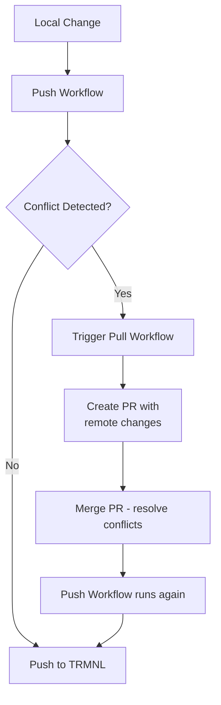

# TRMNLP Sync Workflows

This directory contains two GitHub Actions workflows that synchronize TRMNL plugins between this repository and the TRMNL cloud.

## Workflows Overview

### 1. TRMNLP Pull (`trmnlp-pull.yml`)

**Triggers:** Daily at 00:00 UTC, or manually via workflow dispatch.

**Purpose:** Pulls the latest plugin configurations from the TRMNL cloud and creates a PR if changes are detected.

**How it works:**
1. Checks for an existing `trmnlp-pull-updates` branch with an open PR
   - If the branch exists without an active PR, it deletes and recreates it
   - If an active PR exists, it checks out that branch to add new changes
2. Finds all directories containing `.trmnlp.yml` files
3. Runs `trmnlp pull -f` on each plugin directory using Docker
4. If changes are detected, commits and pushes to the `trmnlp-pull-updates` branch
5. Creates a new PR if one doesn't already exist

### 2. TRMNLP Push (`trmnlp-push.yml`)

**Triggers:** On push to `master` branch, or manually via workflow dispatch.

**Purpose:** Pushes local plugin changes to the TRMNL cloud, with conflict detection.

**How it works:**
1. **Open PR Check:** If there's an open PR from `trmnlp-pull-updates`, the push is skipped to avoid conflicts
2. **Merge Detection:** If the current commit is a merge from the pull branch, skips conflict checking (the merge itself is the resolution)
3. **Change Detection:** Identifies which plugins have changes in the current push
4. **Conflict Check:** For changed plugins, pulls remote state onto the "before" commit to detect if the remote has diverged
   - If diverged: Triggers the pull workflow to create a conflict resolution PR, then fails
   - If no divergence: Proceeds with push
5. **Push:** Runs `trmnlp push -f` on all changed plugins

## Conflict Resolution Flow

## Required Secrets

- `TRMNL_API_KEY`: API key for authenticating with the TRMNL cloud service

## Concurrency

The push workflow uses concurrency control (`group: trmnlp-sync`) to ensure only one sync operation runs at a time, preventing race conditions.
