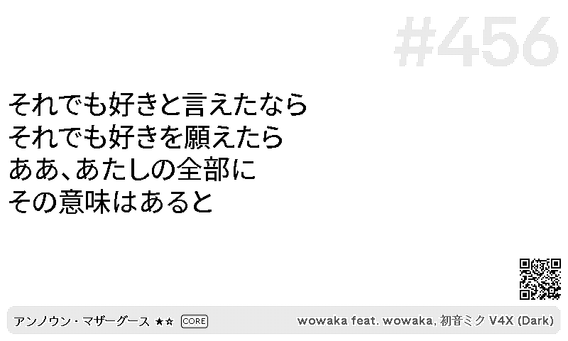
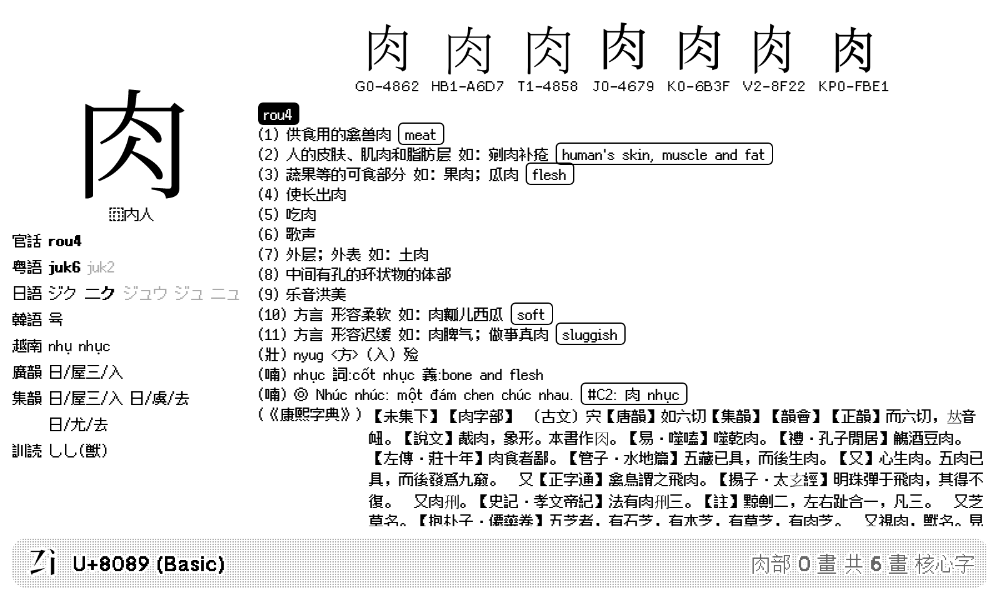
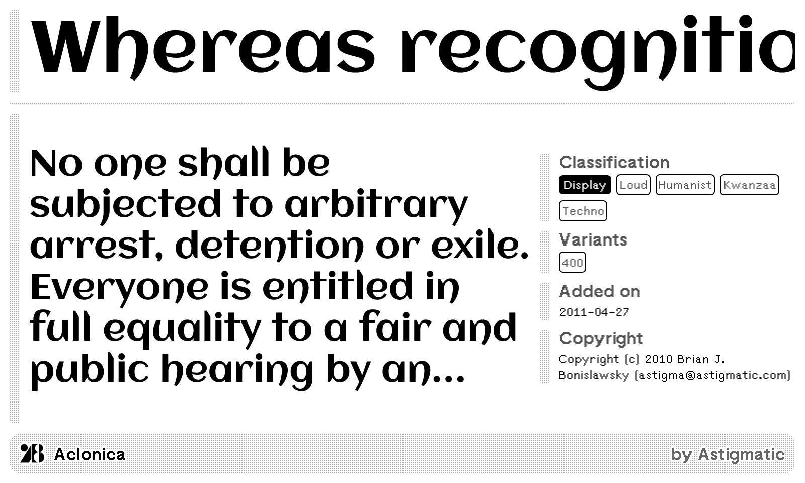
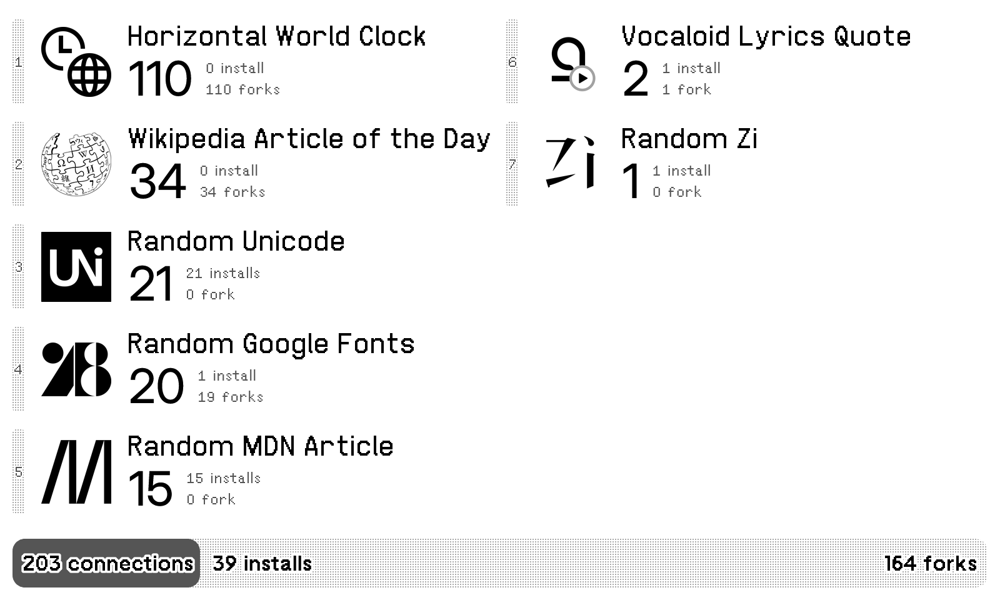
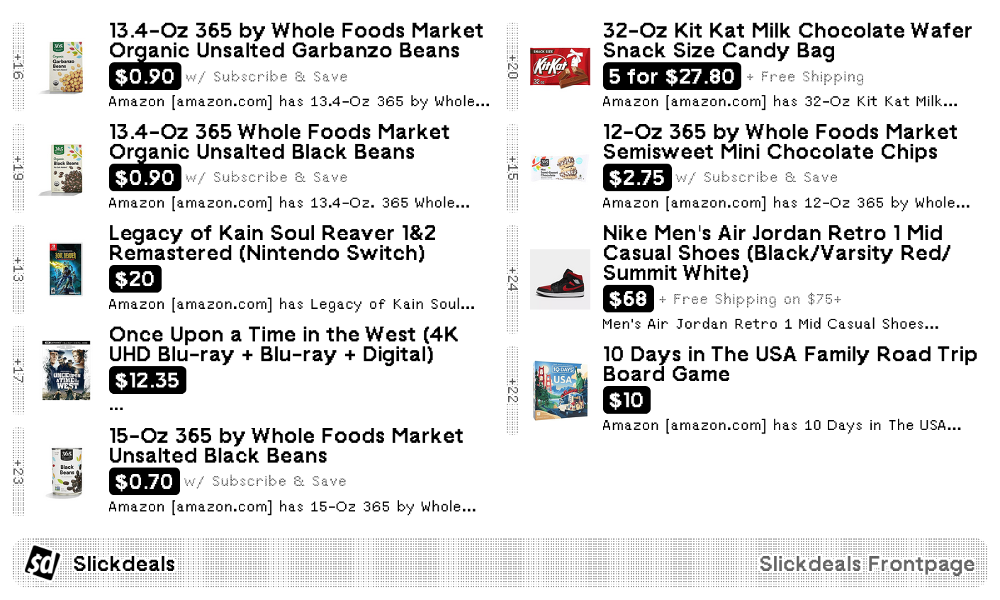
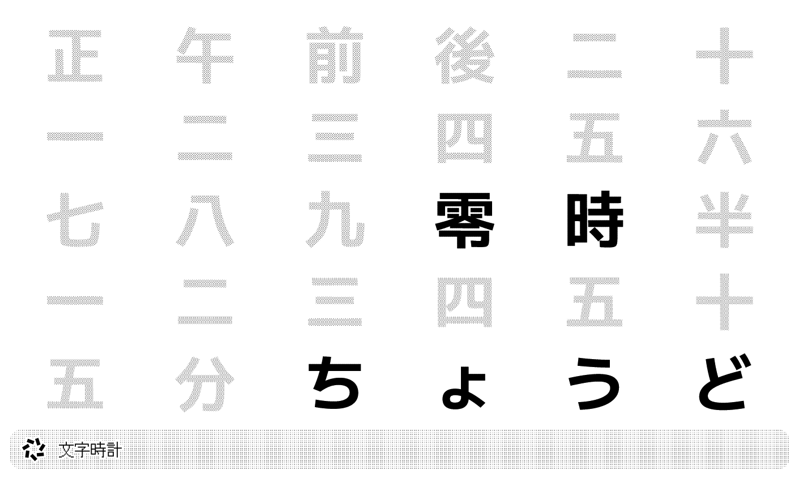
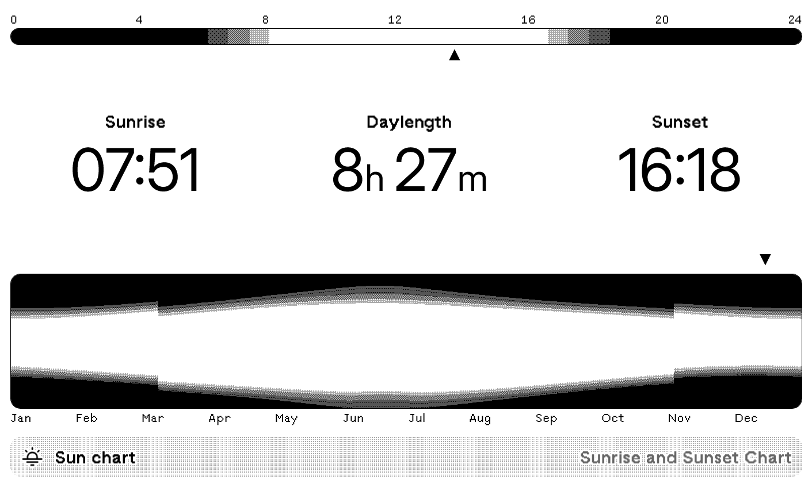
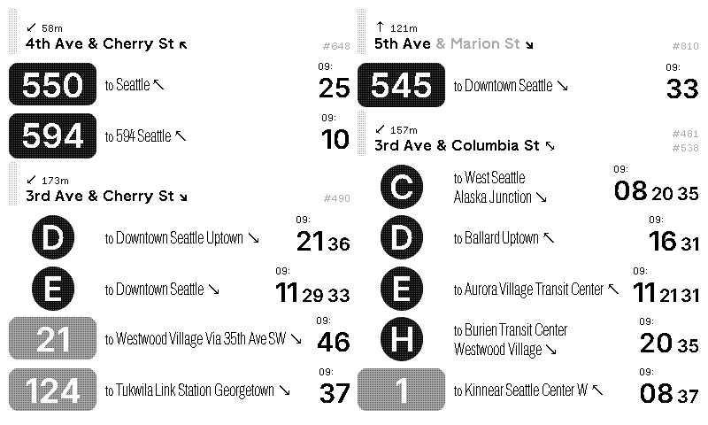
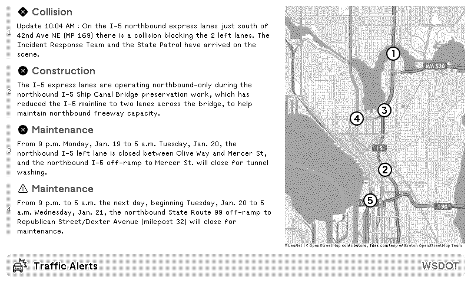

# Eana’s TRMNL Recipies

[What is TRMNL?](https://usetrmnl.com/)

## Table of Contents

* [Wikipedia Feed](#wikipedia-feed)
* [Random Unicode](#random-unicode)
* [Random MDN Article](#random-mdn-article)
* [World clock](#world-clock)
* [Lyricova Quote](#lyricova-quote)
* [Random Zi](#random-zi)
* [Random Google Fonts](#random-google-fonts)
* [Public Recipe Stats](#public-recipe-stats)
* [Tatoeba](#tatoeba)
* [Slickdeals Frontpage](#slickdeals-frontpage)
* [Word Clock 日本語](#word-clock-日本語)
* [Word Clock 中文](#word-clock-中文)
* [Sunrise and Sunset Chart](#sunrise-and-sunset-chart)
* [Visa Bulletin](#visa-bulletin-unlisted)
* [Puget Sound Transit Nearby](#puget-sound-transit-nearby)
* [Washington DOT Real-time Travel Info](#washington-dot-real-time-travel-info)

## Wikipedia Feed

Multilingual Wikipedia feed recipe, supports _Article of the Day_, _On this day_, and _Did you know_, for multiple languages.

[Learn More](./wikipedia-feed/README.md), [Install](https://usetrmnl.com/recipes/148054)

## Random Unicode

A random Unicode codepoint on each refresh. Data powered by [codepoints.net](https://codepoints.net/).

[Learn More](./random-unicode/README.md), [Install](https://usetrmnl.com/recipes/151050)

## Random MDN Article

A random [MDN](https://developer.mozilla.org/) Web article on each refresh.

[Learn More](./random-mdn-article/README.md), [Install](https://usetrmnl.com/recipes/153731)

## World clock

A digital world clock shows up to 7 time zones. Inspired by [World Time Buddy](https://www.worldtimebuddy.com/) and _Windows 11 World Clock_.

[Learn More](./world-clock/README.md), [Install](https://usetrmnl.com/recipes/153664)

## Lyricova Quote

Show a random quote from [Lyricova](https://lyricova.1a23.studio/) on each refresh.

[Learn More](./lyricova-quote/README.md), [Install](https://usetrmnl.com/recipes/150439)

## Random Zi

A random CJKV ideograph with pronunciations, definitions, and regional glyphs on each refresh. Data powered by [zi.tools 字統网](https://zi.tools).

[Learn More](./random-zi/README.md), [Install](https://usetrmnl.com/recipes/156095)

## Random Google Fonts

A random typeface from [Google Fonts](https://fonts.google.com/) on each refresh.

[Learn More](./random-google-fonts/README.md), [Install](https://usetrmnl.com/recipes/163790)

## Public Recipe Stats

Shows connection statistics of public recipes. You can choose to show the latest, search for keywords, show your own recipes, or show selected recipe IDs. Data powered by [TRMNL Recipes API](https://docs.usetrmnl.com/go/public-api/recipes-api).

[Learn More](./public-recipe-stats/README.md), [Install](https://usetrmnl.com/recipes/170970)

## Tatoeba

A random sentence in your chosen languages with translations. Data powered by [Tatoeba](https://tatoeba.org/).

[Learn More](./tatoeba/README.md), [Install](https://usetrmnl.com/recipes/177718)

## Slickdeals Frontpage

Slickdeals Frontpage and Popular deals. Data from Slickdeals RSS feed.

[Learn More](./slickdeals/README.md), [Install](https://usetrmnl.com/recipes/184875)

## Word Clock 日本語

Word clock in Japanese. Supports 24-hour and 12-hour formats, with a maximum display precision of 5 minutes (depending on recipe and device update frequency).

[Learn More](./word-clock-ja/README.md), [Install](https://usetrmnl.com/recipes/187661)

## Word Clock 中文

Word Clock in Chinese. Supports 24-hour and 12-hour formats, as well as Simplified and Traditional Chinese. The highest precision is 5 minutes (determined by the plugin and device refresh rate).

[Learn More](./word-clock-zh/README.md), [Install](https://usetrmnl.com/recipes/187631)

## Sunrise and Sunset Chart

Sunrise and sunset time with a daily and yearly chart.

[Learn More](./sun-chart/README.md), [Install](https://usetrmnl.com/recipes/195274)

## Visa Bulletin (Unlisted)

Show the latest Visa Bulletin information, and trends for filing date and action date.

[Learn More](./visa-bulletin/README.md), [Install](https://usetrmnl.com/recipes/155086)

## Puget Sound Transit Nearby

Dashboard public transit information close to you. Supports all public transit types in Puget Sound, Washington, USA: bus, lightrail, street car, monorail, Amtrak, ferries and more. Supports multiple layouts.

[Learn More](./transit/README.md), [Install](https://usetrmnl.com/recipes/225183)

## Washington DOT Real-time Travel Info

Real-time travel info from Washington State Department of Transportation (WSDOT). Show travel times, traffic cameras, and alerts on your dashboard. Data powered by WSDOT Traffic API.

[Learn More](./wsdot/README.md), [Install](https://usetrmnl.com/recipes/227171)

