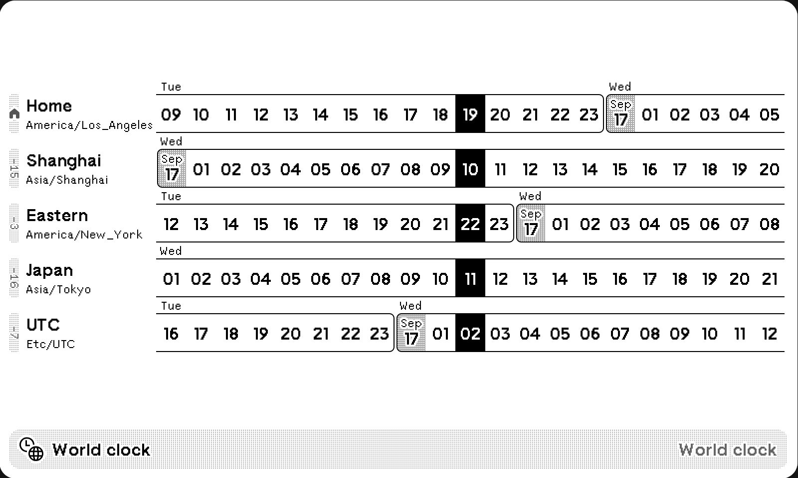

# Eana’s TRMNL Recipies

[What is TRMNL?](https://usetrmnl.com/)

## Wikipedia Article of the Day

A TRMNL plugin that fetches and displays the Wikipedia article of the day in multiple languages.

[Learn More](./wikipedia-article-of-the-day/README.md), [Install](https://usetrmnl.com/recipes/148054)

## Random Unicode

A random Unicode codepoint on each refresh. Data powered by [codepoints.net](https://codepoints.net/).

[Learn More](./random-unicode/README.md), [Install](https://usetrmnl.com/recipes/151050)

## Random MDN Article

A random [MDN](https://developer.mozilla.org/) Web article on each refresh.

[Learn More](./random-mdn-article/README.md), [Install](https://usetrmnl.com/recipes/153731)

## World clock

A digital world clock shows up to 7 time zones. Inspired by [World Time Buddy](https://www.worldtimebuddy.com/) and _Windows 11 World Clock_.

[Learn More](./world-clock/README.md), [Install](https://usetrmnl.com/recipes/153664)

