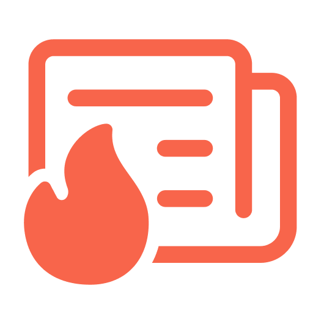
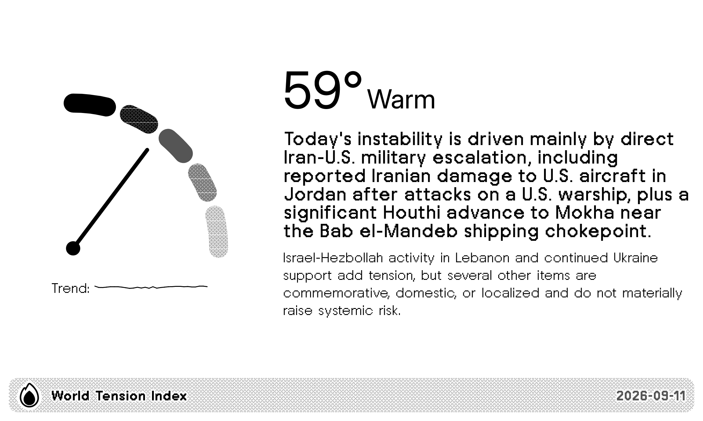
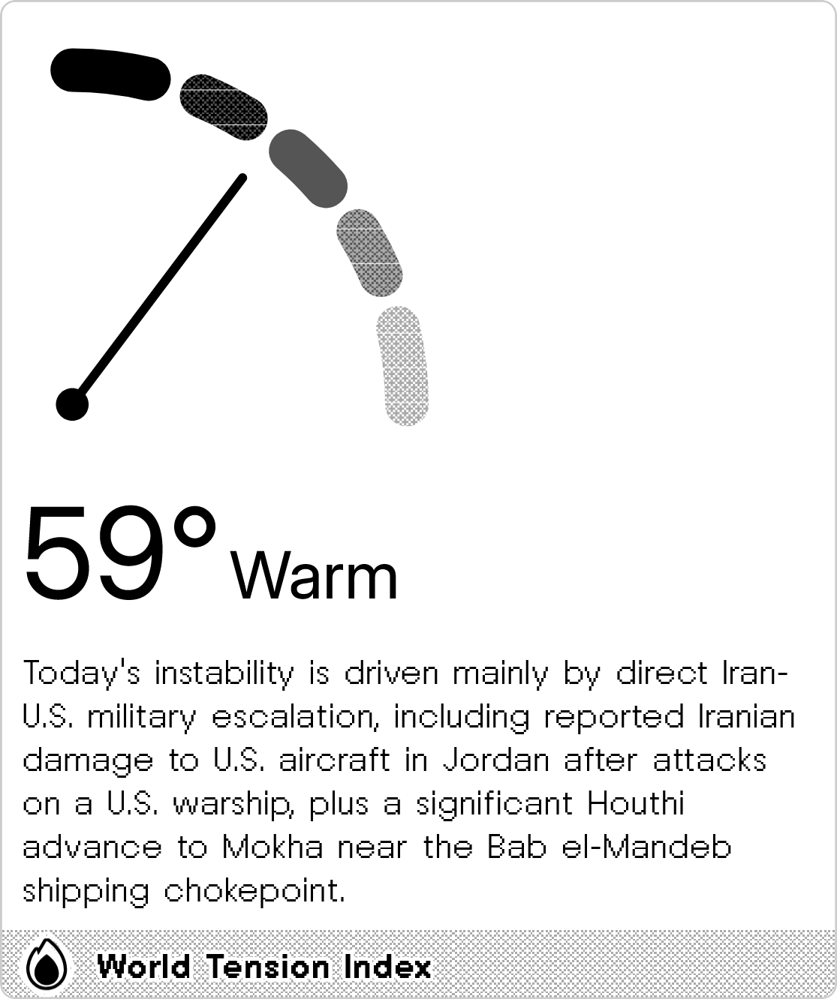
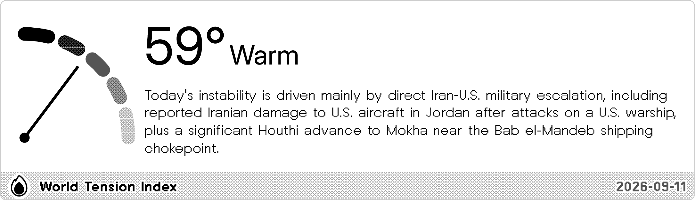
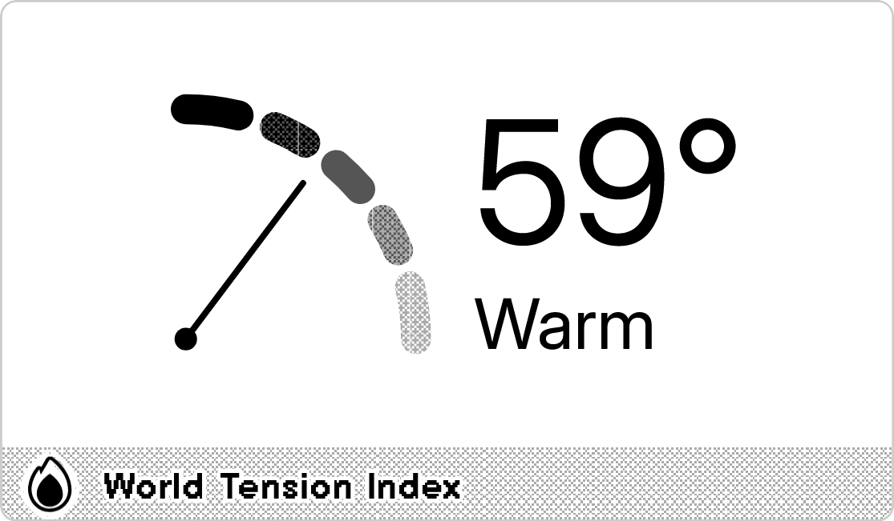

#  World Tension Index

The world tension index, or "Chaos index," is generated by AI analysis of current world news headlines. Rather than a fixed formula, it uses reasoning to evaluate global stability. Data courtesy of [Kagi News](https://news.kagi.com/?view=chaos).

<a href="https://trmnl.com/recipes/454408" target="_blank">
  <picture>
    <source media="(prefers-color-scheme: dark)" srcset="../.assets/trmnl-badge-show-it-on-dark.svg">
    <source media="(prefers-color-scheme: light)" srcset="../.assets/trmnl-badge-show-it-on-light.svg">
    
  </picture>
</a>

## Screenshot

| Full | Vertical |
| :---: | :---: |
|  |  |
| Horizontal | Quad |
|  |  |
