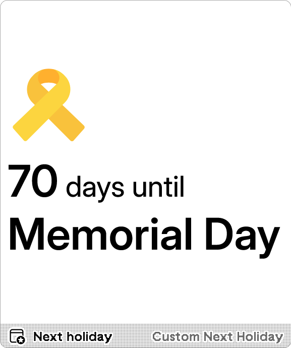
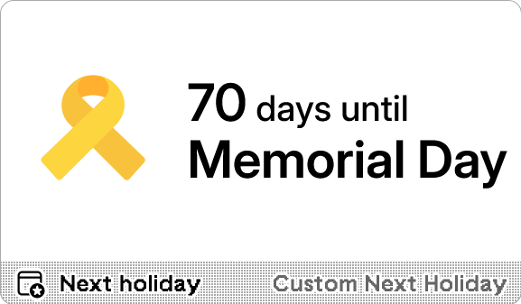

# Custom Next Holiday

Countdown to your custom holidays. Support absolute dates, date of month, and *n*-th weekday of month.

<a href="https://trmnl.com/recipes/257171" target="_blank">
  <picture>
    <source media="(prefers-color-scheme: dark)" srcset="../.assets/trmnl-badge-show-it-on-dark.svg">
    <source media="(prefers-color-scheme: light)" srcset="../.assets/trmnl-badge-show-it-on-light.svg">
    
  </picture>
</a>

## Screenshot

| Full | Vertical |
| :---: | :---: |
|  |  |
| Horizontal | Quad |
|  |  |

## Parameters

- Holidays  
  YAML defining custom holidays. Each entry has a `name`, `date`, optional `icon` (from [Iconify](https://icon-sets.iconify.design/)), and optional `round` (list of weekdays to round to). Supported date formats: `MM-DD` (date of month), `YYYY-MM-DD` (absolute date), `MMWn-D` (*n*-th weekday of month), `MMWnw-D` (last *n*-th weekday of month). Append `[u-ca=calendar]` for alternate calendar systems.
