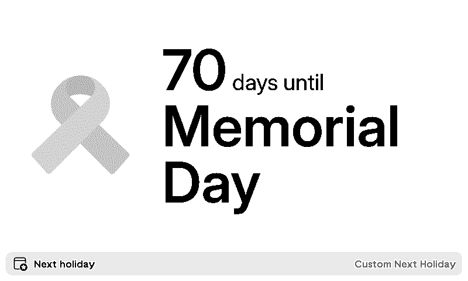
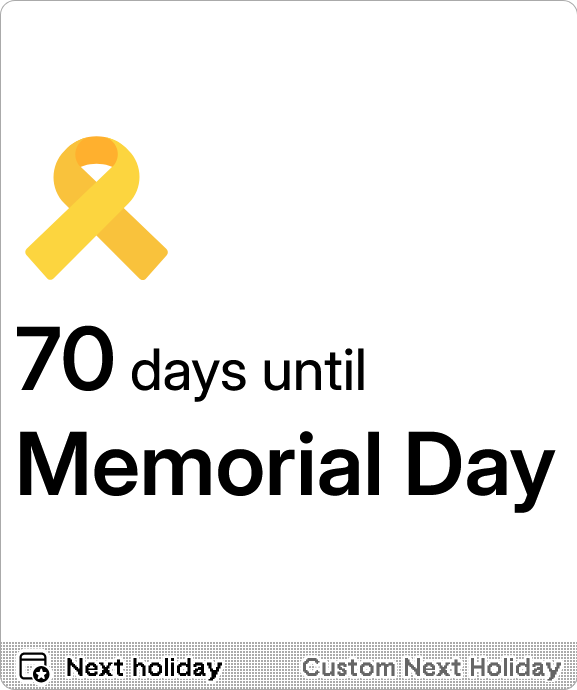
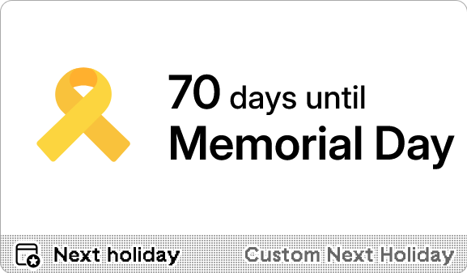

#  Custom Next Holiday

Countdown to your custom holidays. Support absolute dates, date of month, and *n*-th weekday of month.

Holidays falling on the same day are shown together using your locale's short conjunction list, with holiday names in the main value style and separators in the main label style. An icon from one of those holidays is used. When today has multiple holidays, the next-holiday row is hidden. When today has one holiday, all names and separators in the next-holiday row use the smaller sub-label style.

<a href="https://trmnl.com/recipes/257171" target="_blank">
  <picture>
    <source media="(prefers-color-scheme: dark)" srcset="../.assets/trmnl-badge-show-it-on-dark.svg">
    <source media="(prefers-color-scheme: light)" srcset="../.assets/trmnl-badge-show-it-on-light.svg">
    
  </picture>
</a>

## Screenshot

| Full | Vertical |
| :---: | :---: |
|  |  |
| Horizontal | Quad |
|  |  |

## Parameters

- Holidays  
  YAML defining custom holidays. Each entry has a `name`, `date`, optional `icon` (from [Iconify](https://icon-sets.iconify.design/)), and optional `round` (list of weekdays to round to). Supported date formats: `MM-DD` (date of month), `YYYY-MM-DD` (absolute date), `MMWn-D` (*n*-th weekday of month), `MMWnw-D` (last *n*-th weekday of month). Append `[u-ca=calendar]` for alternate calendar systems. Use the <a href="https://blueset.github.io/trmnl-recipes/holiday-editor/index.html" target="_blank">Holiday Editor</a> to easily add, edit, and manage your holidays, or learn more about the <a href="https://blueset.github.io/trmnl-recipes/holiday-editor/index.html#reference" target="_blank">supported date formats</a>.
- **Upcoming holiday to display:** Select the upcoming holiday date to show, starting at 1. Holidays sharing a resolved date (including weekday rounding) count as one date.
