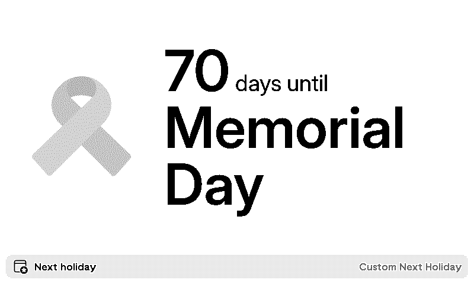
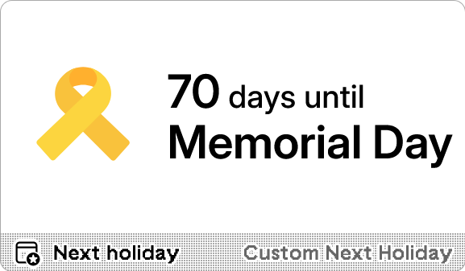

#  Custom Next Holiday

Countdown to your custom holidays. Support absolute dates, date of month, and *n*-th weekday of month.

Holidays falling on the same day are shown together using your locale's short conjunction list, with holiday names in the main value style and separators in the main label style. An icon from one of those holidays is used. When today has multiple holidays, the next-holiday row is hidden. When today has one holiday, all names and separators in the next-holiday row use the smaller sub-label style.

<a href="https://trmnl.com/recipes/257171" target="_blank">
  <picture>
    <source media="(prefers-color-scheme: dark)" srcset="../.assets/trmnl-badge-show-it-on-dark.svg">
    <source media="(prefers-color-scheme: light)" srcset="../.assets/trmnl-badge-show-it-on-light.svg">
    
  </picture>
</a>

## Screenshot

| Full | Vertical |
| :---: | :---: |
|  |  |
| Horizontal | Quad |
|  |  |

## Parameters

- Holidays  
  YAML defining custom holidays. Each entry has a `name`, `date`, optional `icon` (from [Iconify](https://icon-sets.iconify.design/)), and optional `round` (list of weekdays to round to). Supported date formats: `MM-DD` (date of month), `YYYY-MM-DD` (absolute date), `MMWn-D` (*n*-th weekday of month), `MMWnw-D` (last *n*-th weekday of month). Append `[u-ca=calendar]` for alternate calendar systems. Use the <a href="https://blueset.github.io/trmnl-recipes/holiday-editor/index.html" target="_blank">Holiday Editor</a> to add, edit, and manage your holidays. Start from ready-made templates (public holidays, lunar festivals, birthdays, paydays, events…), and sign in with TRMNL to load and save your plugins directly, or learn more about the <a href="https://blueset.github.io/trmnl-recipes/holiday-editor/index.html#reference" target="_blank">supported date formats</a>.
- **Upcoming holiday to display:** Select the upcoming holiday date to show, starting at 1. Holidays sharing a resolved date (including weekday rounding) count as one date.

## Holiday Editor

The [Holiday Editor](https://blueset.github.io/trmnl-recipes/holiday-editor/) is a static web app with a searchable holiday list, a focused date editor, and dark/light/system appearance options. On mobile, select a holiday to open its detail screen. Calendar rules, weekday adjustments, and date expressions are available in the supporting sections. Select the icon beside a holiday's title to open and focus its icon editor. Invalid fields are outlined, and collapsed sections indicate errors that need attention.

Use **Templates** to add ready-made entries, or **More actions > Import YAML** to replace an existing list. **Copy YAML** exports the list for your plugin's Holidays field; **More actions > View YAML** lets you inspect or manually copy it. Single-holiday deletion offers Undo. Reordering preserves the list's original order, including when searching.

The local editor saves your draft in this browser, not to TRMNL. Connected editing saves only when you press **Save to TRMNL**, and can copy the holidays to other plugins after confirmation. Keep a copy of your YAML when using a shared computer or if browser storage is unavailable. Icon browsing needs an internet connection.

### Developing the editor

Use Node.js 22.12+ (or 20.19+) and run `npm ci`, then `npm run dev:holiday-editor`. The Vue/Vite development app runs at `http://127.0.0.1:5173/`. The existing date/model/template tests run with `npm test`.

Run `npm run build:recipes` to generate the gallery index, then `npm run build:pages` to stage the entire static site in `dist`. `npm run preview:pages` serves it at `http://127.0.0.1:4173/holiday-editor/`; the source HTML is no longer intended to be served without the build. The gallery-index generator requires complete recipe metadata for every recipe folder, including local untracked folders.

For UI regressions, run `npx playwright install chromium firefox webkit` once, then `npm run test:ui`. Tests use the production artifact and mocked TRMNL responses, not a real account. OAuth testing requires registering the matching local callback URI in the existing TRMNL Developer App; no secret belongs in this frontend.
