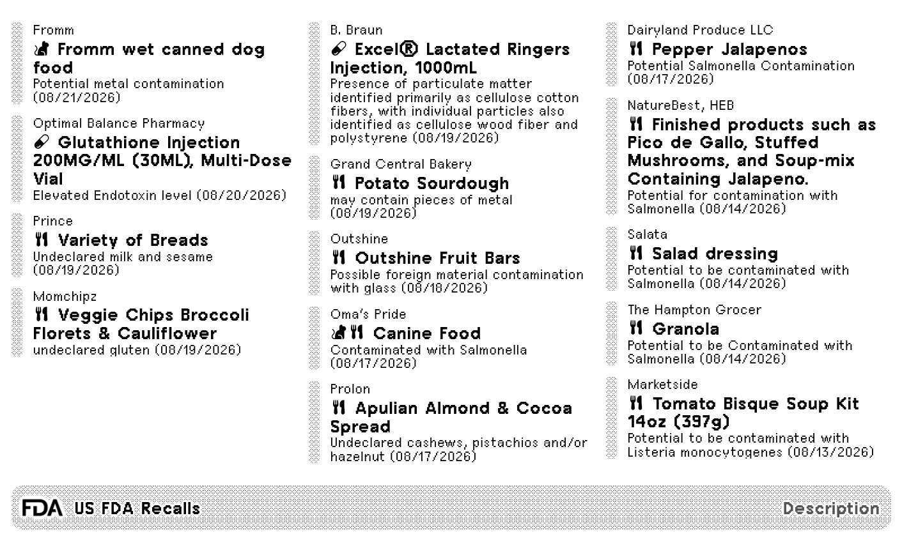
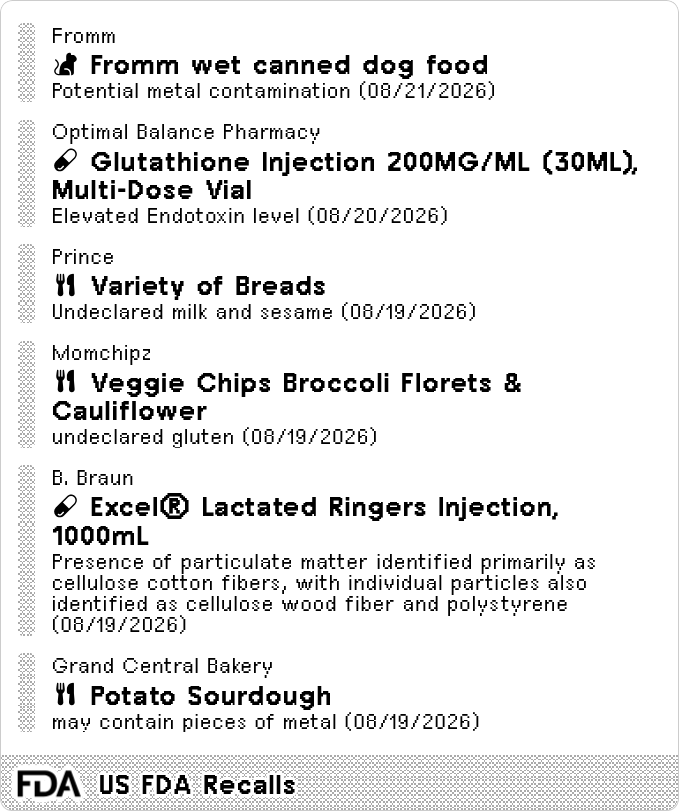
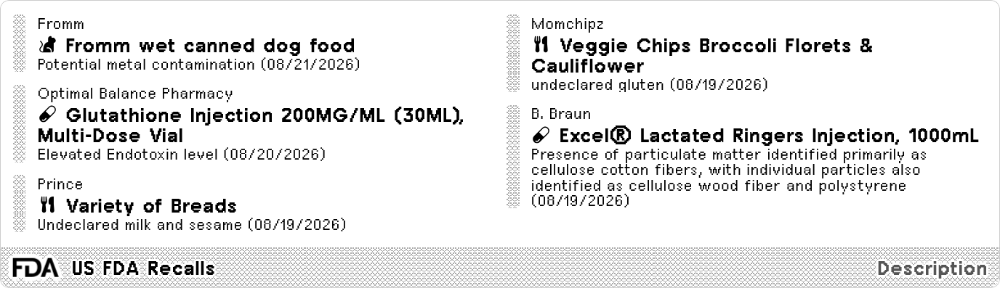
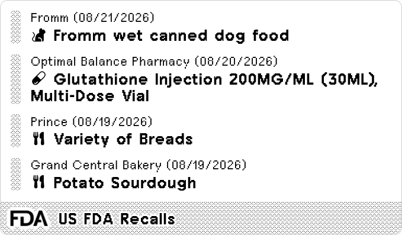

#  US FDA Recalls

Recent recalls, market withdrawals, and safety alerts of FDA-regulated products. Data courtesy of [FDA](https://www.fda.gov/safety/recalls-market-withdrawals-safety-alerts).

<a href="https://trmnl.com/recipes/453276" target="_blank">
  <picture>
    <source media="(prefers-color-scheme: dark)" srcset="../.assets/trmnl-badge-show-it-on-dark.svg">
    <source media="(prefers-color-scheme: light)" srcset="../.assets/trmnl-badge-show-it-on-light.svg">
    
  </picture>
</a>

## Screenshot

| Full | Vertical |
| :---: | :---: |
|  |  |
| Horizontal | Quad |
|  |  |

## Parameters

- Search keyword  
  Free text; optional. Leave empty to show all recalls.
- Product Type  
  All, Animal & Veterinary, Biologics, Cosmetics, Dietary Supplements, Drugs, Food & Beverages, Medical Devices, Radiation-Emitting Products, or Tobacco; default: All
- Terminated Recall  
  All, Yes, or No; default: All