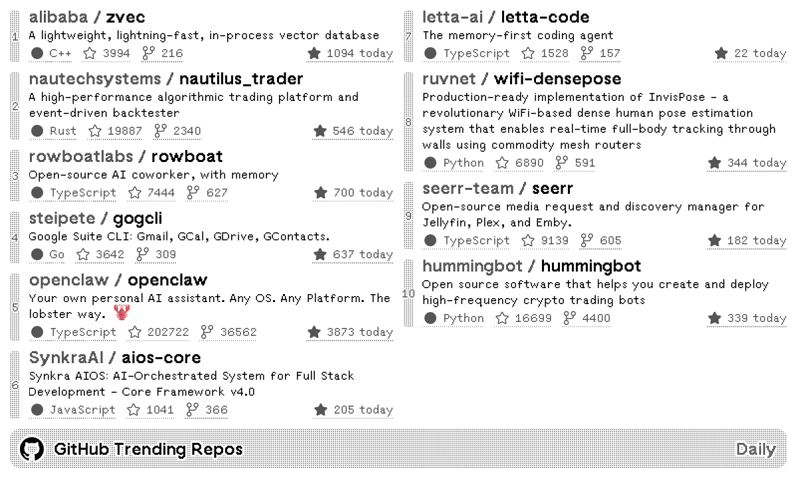
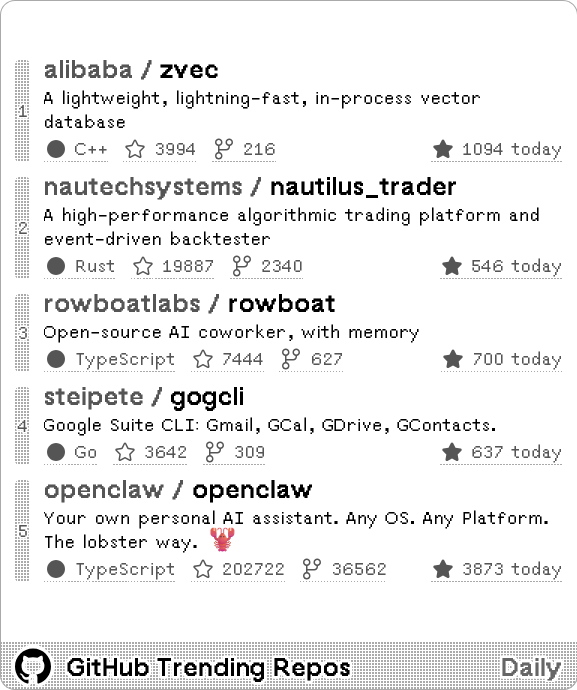
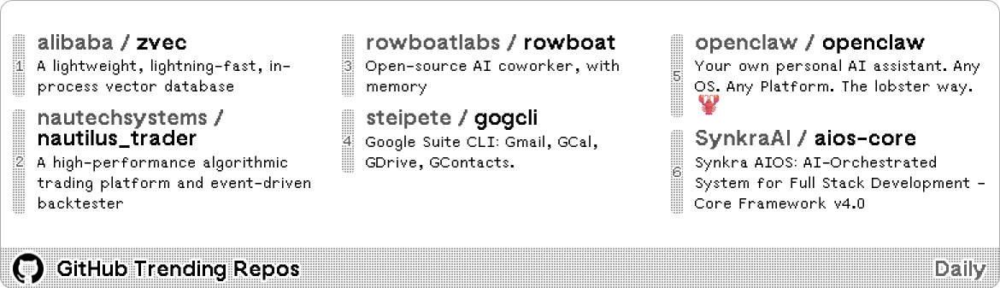
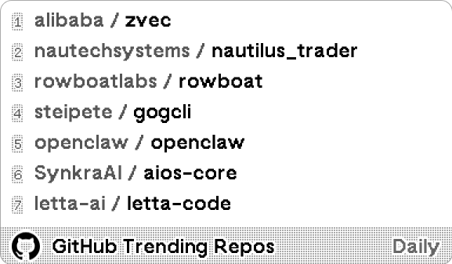

# GitHub Trending Repos

GitHub Trending Repositories. API courtesy of [doforce](https://github.com/doforce/github-trending).

[Install](https://usetrmnl.com/recipes/243710)

## Screenshot

| Full | Vertical |
| :---: | :---: |
|  |  |
| Horizontal | Quad |
|  |  |

## Parameters

- **Duration**: Daily, Weekly, Monthly, default: Daily
- **Language**: All, Unknown languages, 1C Enterprise, 2-Dimensional Array, 4D, ABAP, ... and 800+ more languages. default: All
