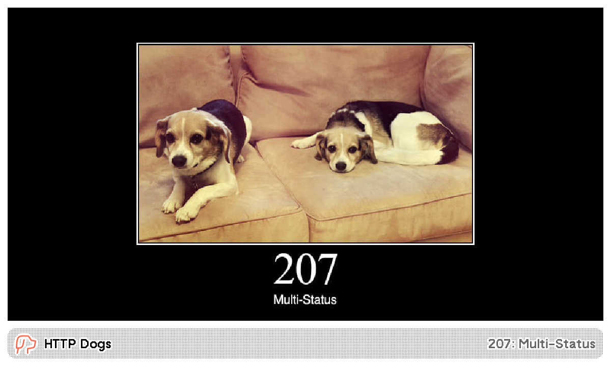
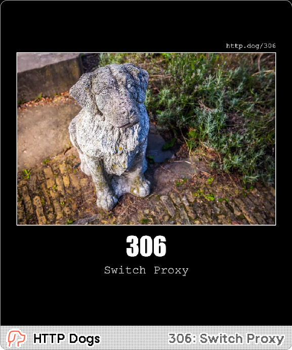
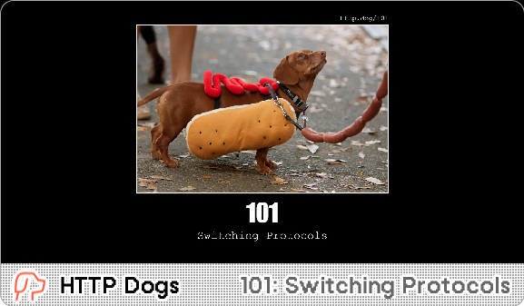

# HTTP Dogs

A random HTTP Dog picture on each refresh. Works well with [HTTP Cats](https://trmnl.com/recipes/235410) too. Images from [HTTP Dogs](https://http.dog/) and [HTTP Status Dogs](https://httpstatusdogs.com/).

[Install](https://usetrmnl.com/recipes/243773)

## Screenshot

| Full | Vertical |
| :---: | :---: |
|  |  |
| Horizontal | Quad |
|  |  |
