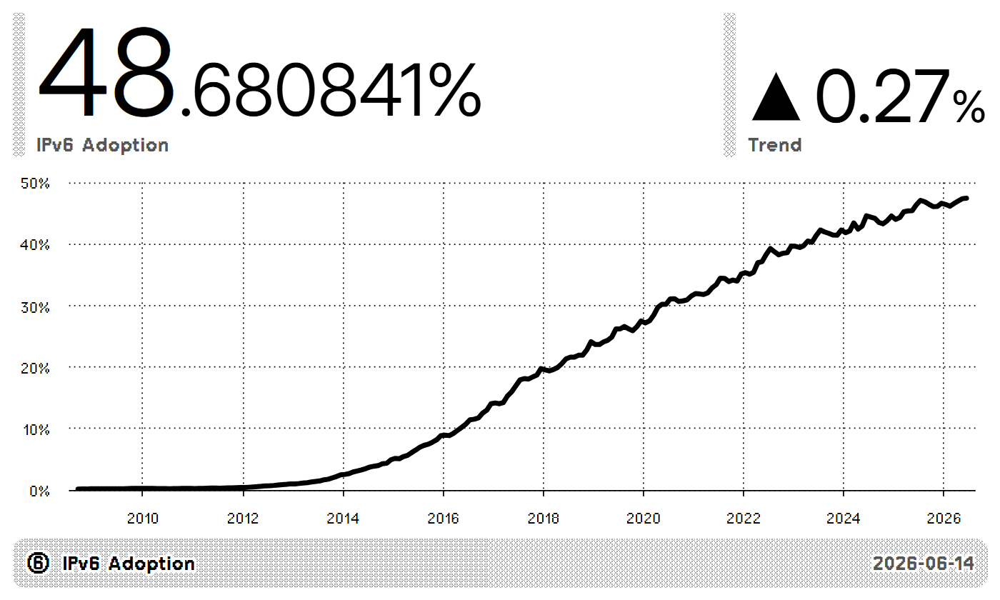
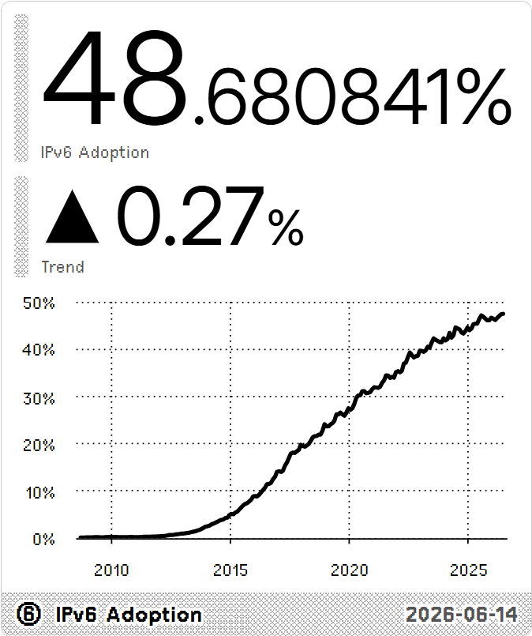
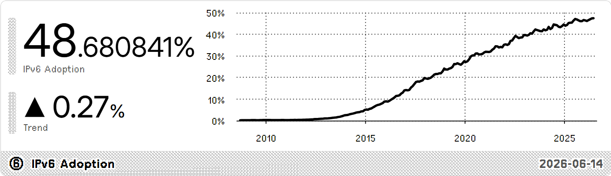
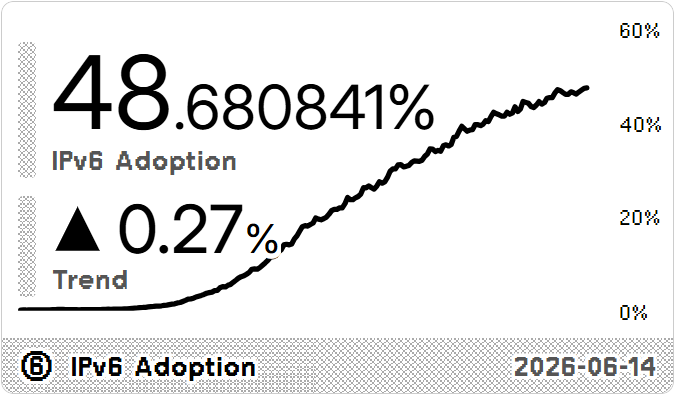

#  IPv6 Adoption

Tracking global adoption of IPv6. Data source: [Google](https://www.google.com/intl/en/ipv6/statistics.html). The graph shows the percentage of users that access Google over IPv6.

<a href="https://trmnl.com/recipes/345789" target="_blank">
  <picture>
    <source media="(prefers-color-scheme: dark)" srcset="../.assets/trmnl-badge-show-it-on-dark.svg">
    <source media="(prefers-color-scheme: light)" srcset="../.assets/trmnl-badge-show-it-on-light.svg">
    
  </picture>
</a>

## Screenshot

| Full | Vertical |
| :---: | :---: |
|  |  |
| Horizontal | Quad |
|  |  |
