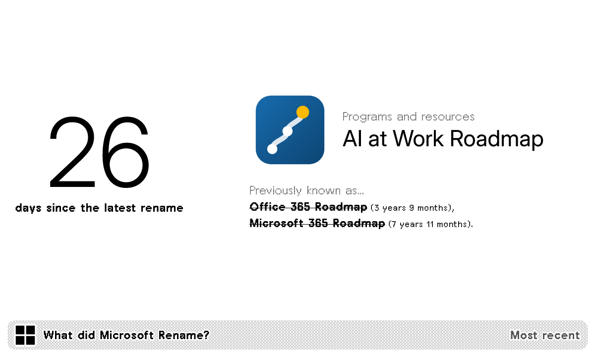
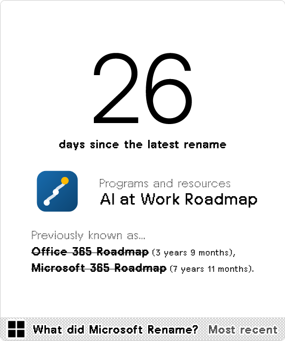
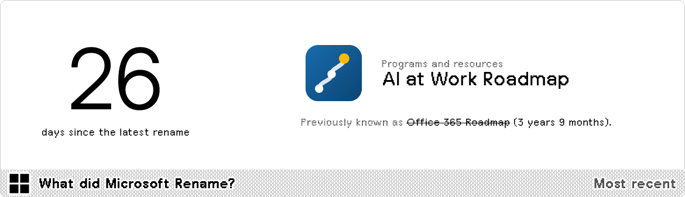
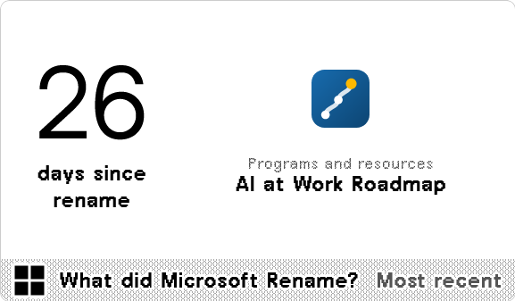

#  What did Microsoft Rename?

Every rename Microsoft has made throughout its history. Data courtesy of [The Rebrand Registry](https://www.msrebrandregistry.com/index.html).

<a href="https://trmnl.com/recipes/482364" target="_blank">
  <picture>
    <source media="(prefers-color-scheme: dark)" srcset="../.assets/trmnl-badge-show-it-on-dark.svg">
    <source media="(prefers-color-scheme: light)" srcset="../.assets/trmnl-badge-show-it-on-light.svg">
    
  </picture>
</a>

## Screenshot

| Full | Vertical |
| :---: | :---: |
|  |  |
| Horizontal | Quad |
|  |  |

## Parameters

- Display option  
  Recent or Random; default: Recent
