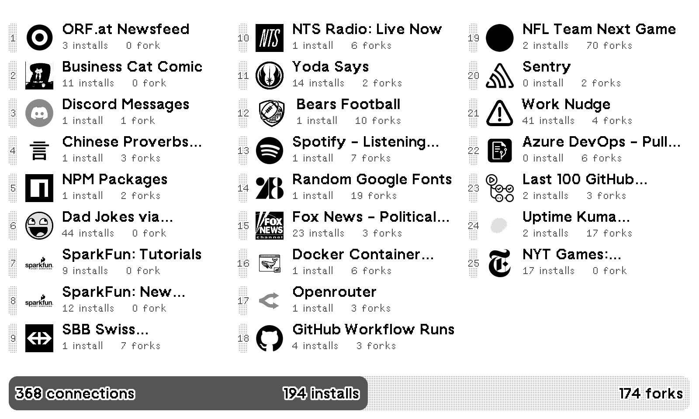
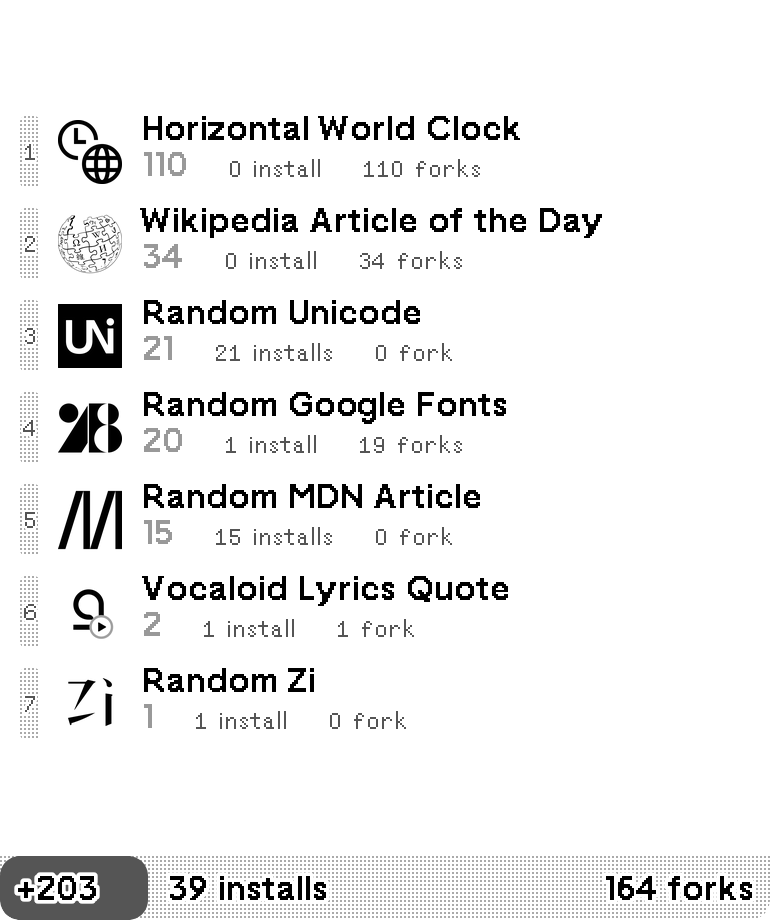
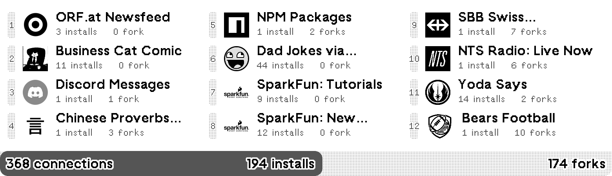
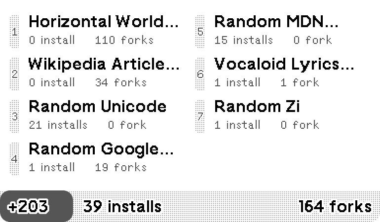

# Public Recipe Stats

Shows connection statistics of public recipes. You can choose to show the latest, search for keywords, show your own recipes, or show selected recipe IDs. Data powered by [TRMNL Recipes API](https://docs.usetrmnl.com/go/public-api/recipes-api).

[Install](https://usetrmnl.com/recipes/170970)

## Screenshot

| Full (Large) | Full (Small) | Vertical |
| :---: | :---: | :---: |
|  |  |  |

| Horizontal | Quad |
| :---: | :---: |
|  |  |

## Parameters

- Selection (Latest, Keyword, Author ID, Selected IDs)
- Keyword (only if Selection is Keyword, defaults to show everything)
- Author ID (only if Selection is Author ID, defaults to your own user ID)
- Selected IDs (only if Selection is Selected IDs)
- Layout in full view (Large, Small)r
