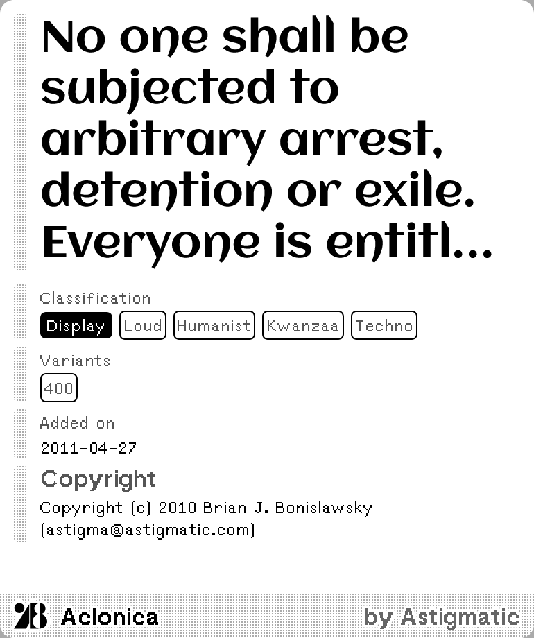
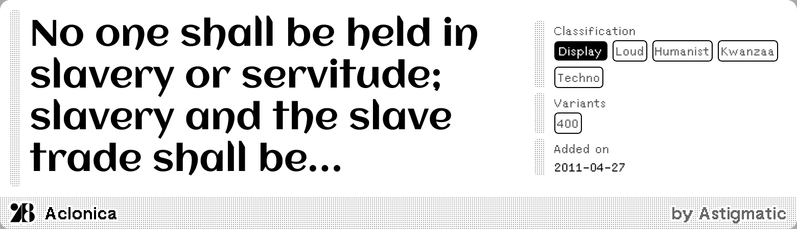

# Random Google Fonts

A random typeface from [Google Fonts](https://fonts.google.com/) on each refresh.

[Install](https://usetrmnl.com/recipes/163790)

## Screenshot

| Full | Vertical |
| :---: | :---: |
|  |  |
| Horizontal | Quad |
|  |  |

### Multilingual support

| Full | Vertical |
| :---: | :---: |
|  |  |
| Horizontal | Quad |
|  |  |

## Parameters

### Sample text override

`large`: Single-line sample text, only visible in full size.  
`small`: Multi-line sample text, visible in all sizes.

Examples:

Override all fonts:

```json
{
    "large": [["1", "The quick brown fox jumps over the lazy dog."]],
    "small": [["1", "Few black taxis drive up major roads on quiet hazy nights."]]
}
```

Override fonts for Latin script:

```json
{
    "large": [["f.primary_language.endsWith('Latn')", "The quick brown fox jumps over the lazy dog."]]
}
```

Override fonts for full Japanese fonts and Hiragana only fonts:

```json
{
    "large": [
        ["f.primary_language.endsWith('Jpan')", "愛のあるユニークで豊かな書体"],
        ["f.primary_language.endsWith('Hira')", "ゆにいくでゆたかなあいのもじ"]
    ]
}
```

Technical details for TypeScript savvy:

```ts
interface OverrideConfig {
    [size: "small" | "large"]?: Array<
        [
            /**
             * The condition to match. This is a JavaScript expression where `f` is the font metadata object.
             * You can use any valid JavaScript expression to check properties of the font.
             * Check the metadata properties here under `$.fonts[]`:
             * https://blueset.github.io/google-fonts-metadata/metadata.json
             */
            condition: string,
            /** The sample text to use when the condition matches. */
            sampleText: string
        ]
    >;
}
```
