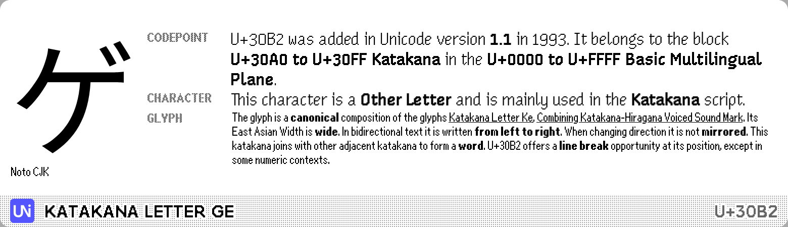
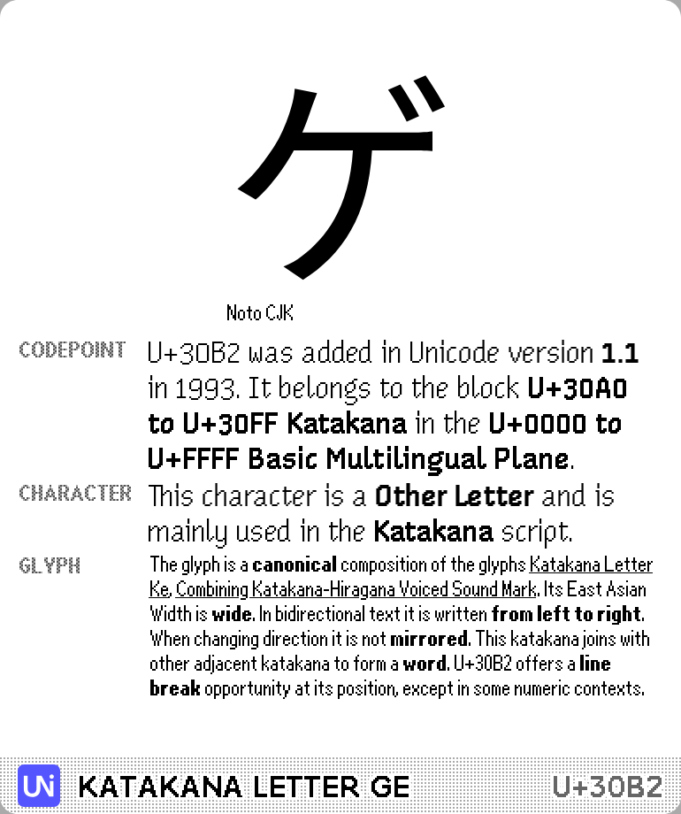

# Random Unicode

A random Unicode codepoint on each refresh. Data powered by [codepoints.net](https://codepoints.net/).

[Install](https://usetrmnl.com/recipes/151050)

## Screenshots

| Full | Horizontal |
| :---: | :---: |
|  |  |
| Vertical | Quad |
|  |  |
