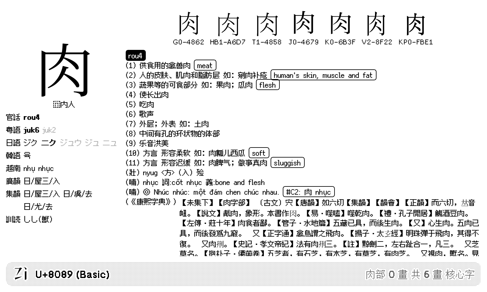

# Random Zi

A random CJKV ideograph with pronunciations, definitions, and regional glyphs on each refresh. Data powered by [zi.tools 字統网](https://zi.tools).

[Install](https://usetrmnl.com/recipes/156095)

## Screenshot

| Full | Horizontal |
| :---: | :---: |
|  |  |
| Vertical | Quad |
|  |  |

### Shorter definition

| Full | Horizontal |
| :---: | :---: |
|  |  |
| Vertical | Quad |
|  |  |
