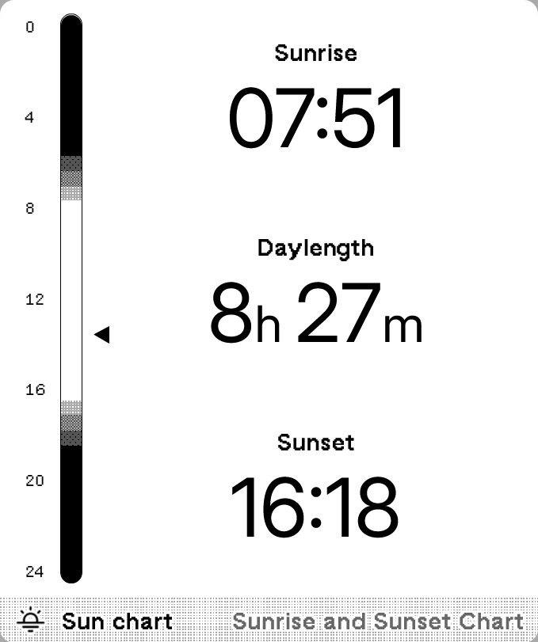
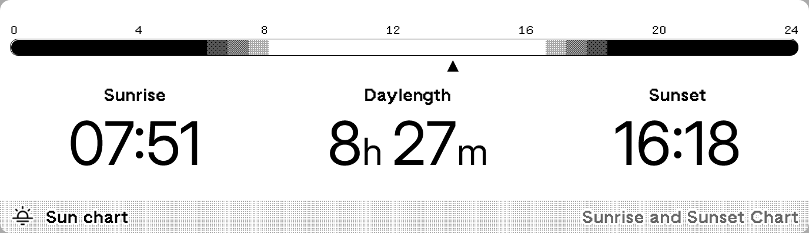
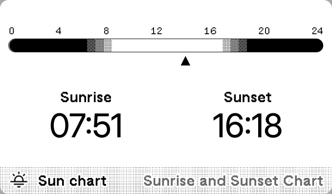

# Sunrise and Sunset Chart

Sunrise and sunset time with a daily and yearly chart.

[Install](https://trmnl.com/recipes/195274)

## Screenshot

| Full | Vertical |
| :---: | :---: |
|  |  |
| Horizontal | Quad |
|  |  |

## Parameters

- Latitude  
  Enter latitude for the location (e.g., 37.7749).
- Longitude  
  Enter longitude for the location (e.g., -122.4194).
- Time format  
  24-hour, 12-hour, default: 24-hour
- Time Zone  
  Optional. Leave blank to auto-detect based on location, or specify a time zone.
