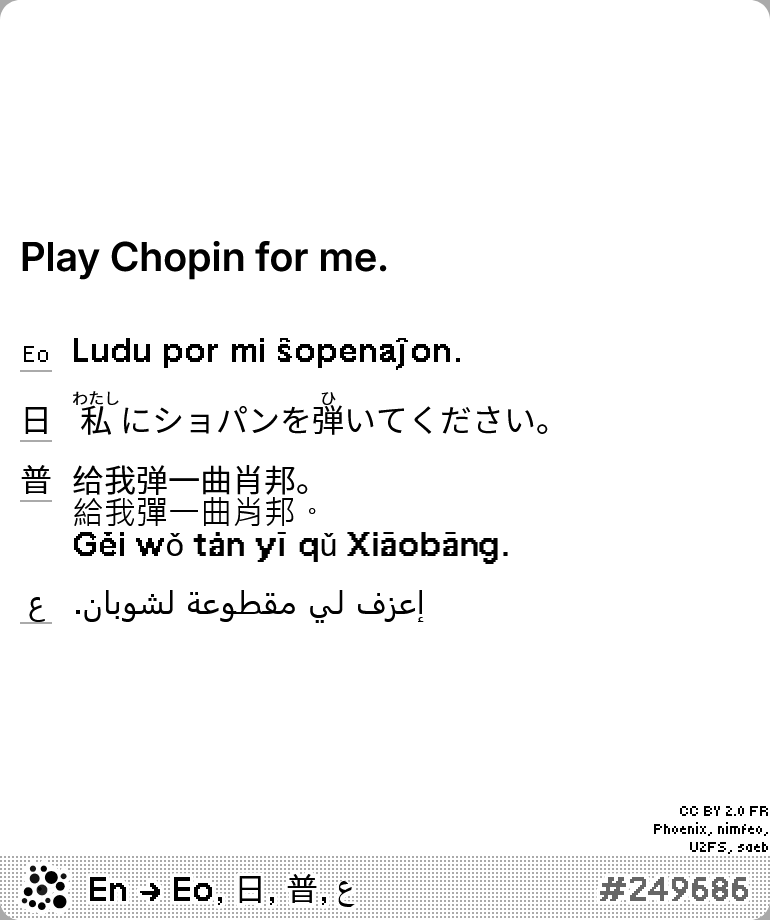
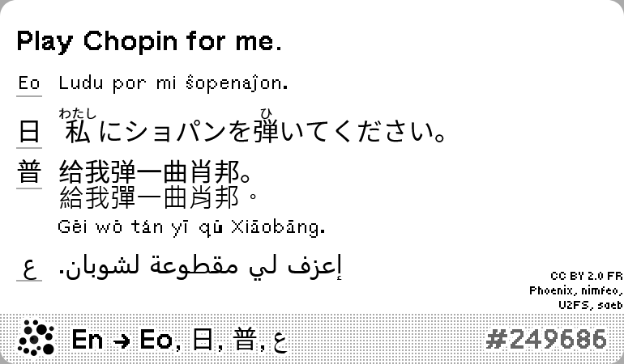

# Tatoeba

A random sentence in your chosen languages with translations. Data powered by [Tatoeba](https://tatoeba.org/).

[Install](https://trmnl.com/recipes/177718)

## Screenshot

| Full | Vertical |
| :---: | :---: |
|  |  |
| Horizontal | Quad |
|  |  |

## Parameters

- **Main language**: Language of sentence to be displayed in large font. [View all languages](https://tatoeba.org/en/stats/sentences_by_language) on Tatoeba.
- **Translation languages**: Language of sentence to be displayed in small font. Optional.
- **Tags**: Tags to pick sentences from. [View all tags](https://tatoeba.org/en/tags/view_all) on Tatoeba. Optional.
- **Approved Sentences Only**: If enabled, only sentences that have been approved by Tatoeba moderators will be used.
- **Lists**: List IDs to pick sentences from. [View all lists](https://tatoeba.org/en/sentences_lists/index) on Tatoeba. Optional.
- **Search Query**: A search query to filter sentences. [Learn more about Tatoeba advanced search syntax](https://en.wiki.tatoeba.org/articles/show/text-search). Optional.
- **Word Count**: A word count range to filter sentences. Leave empty to allow all word counts. Optional.
- **Show Romanization**: For sentences or translation that has romanization available. See below for options specific to Chinese. Default is disabled.
- **Mandarin Chinese Display Style**: Choose how to display Mandarin Chinese sentences when selected as main or translation language. Multiple options can be selected. Default is Traditional.
  - **Simplified**: Display Simplified Chinese characters.
  - **Traditional**: Display Traditional Chinese characters.
  - **Pinyin**: Display Pinyin romanization.
- **Japanese Display Style**: Choose how to display Japanese sentences when selected as main or translation language. Default to show furigana.
  - **Show the sentence without furigana**
  - **Show the sentence with furigana**
- **Sentences Per Translation Language**: Number of sentences to show per selected translation language. Default is all.
  - **All sentences**
  - **Only the first sentence**
