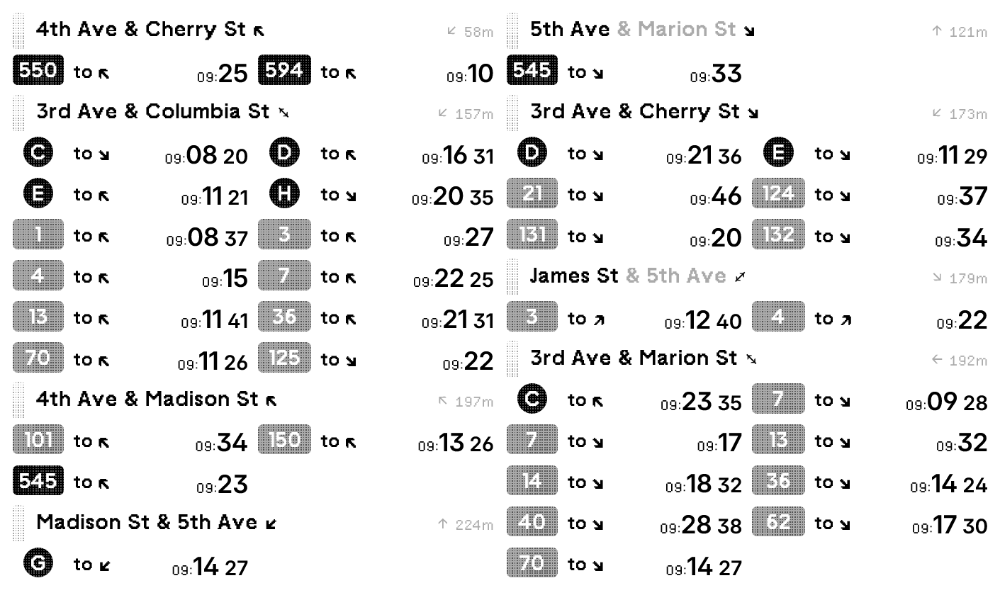
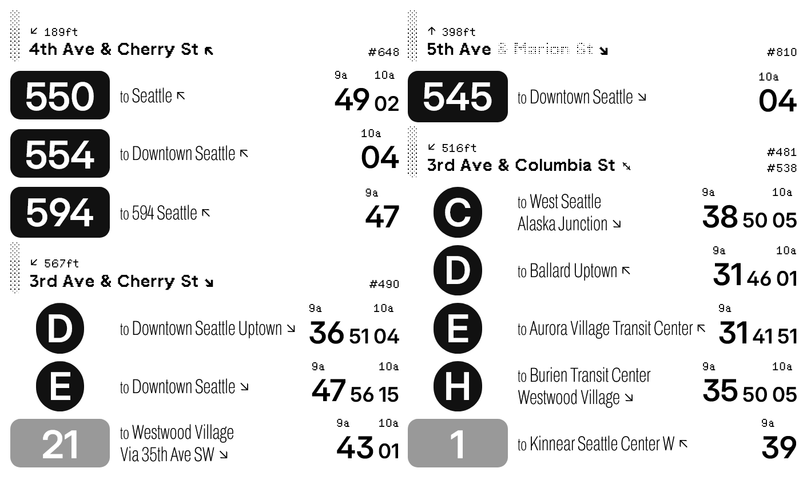
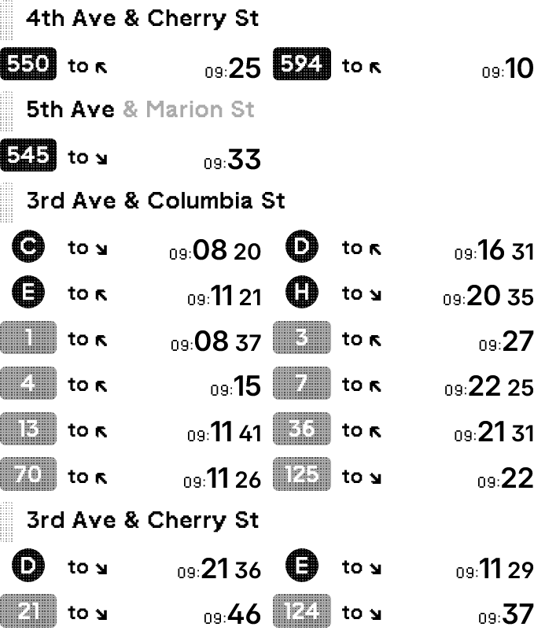
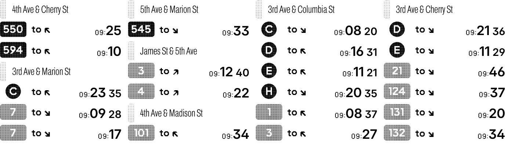
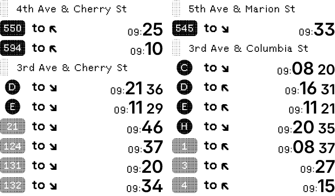

# Puget Sound Transit Nearby

Dashboard public transit information close to you. Supports all public transit types in Puget Sound, Washington, USA: bus, lightrail, street car, monorail, Amtrak, ferries and more. Supports multiple layouts.

[Install](https://trmnl.com/recipes/225183)

## Screenshot

| Full (large) | Full (compact) |
| :---: | :---: |
|  |  |
| Full (Feet, 12-hours clock) | Vertical |
|  |  |
| Horizontal | Quad |
|  |  |

## Parameters

- OneBusAway API Key  
  Check [Sound Transit OTD](https://www.soundtransit.org/help-contacts/business-information/open-transit-data-otd) for details on obtaining an API key.
- Latitude
- Longitude
- Radius in meters  
  Radius from origin to look for stops, default: 500
- Time format  
  24-hour / 12-hour, default: 24-hour
- Distance Unit  
  meter / feet, default: meter
- Stops to show  
  Specify stops to show, all stops nearby are shown by default.
- Routes to show  
  Specify routes to show for nearby or selected stops, all routes nearby are shown by default.
- Layout in full view  
  Large / Compact, default: Large
