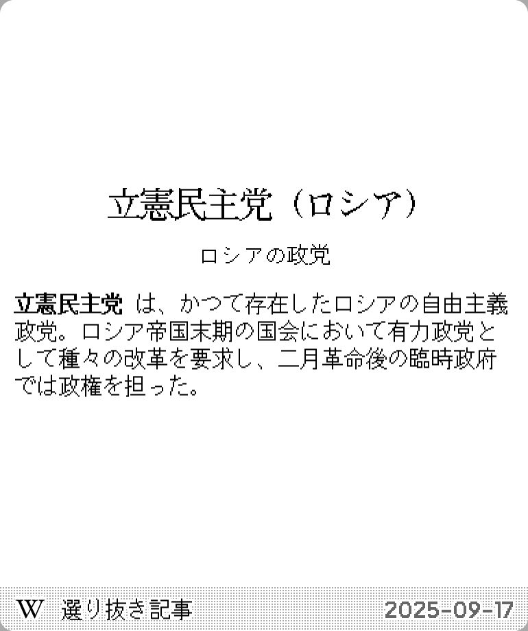

# Wikipedia Article of the Day

A TRMNL plugin that fetches and displays the Wikipedia article of the day in multiple languages.

[Install](https://usetrmnl.com/recipes/148054)

## Screenshots

### English

| Full | Vertical |
| :---: | :---: |
|  |  |
| Horizontal | Quad |
|  |  |

### Chinese

| Full | Vertical |
| :---: | :---: |
|  |  |
| Horizontal | Quad |
|  |  |

### Japanese

| Full | Vertical |
| :---: | :---: |
|  |  |
| Horizontal | Quad |
|  |  |

## Parameters

- **Language**: বাংলা (Bengali), Deutsch (German), Ελληνικά (Greek), English (English), עברית (Hebrew), Magyar (Hungarian), 日本語 (Japanese), سنڌي، سندھی ، सिन्ध (Sindhi), Svenska (Swedish), اردو (Urdu), Tiếng Việt (Vietnamese), 中文 (Chinese)
- **Date format**: Format the date, see [strftime](https://strftime.net/) for syntax. Default: `%Y-%m-%d`
