# Wikipedia Feed

Multilingual Wikipedia feed recipe, supports _Article of the Day_, _In the news_, and _Did you know_, for multiple languages.

<a href="https://trmnl.com/recipes/148054" target="_blank">
  <picture>
    <source media="(prefers-color-scheme: dark)" srcset="../.assets/trmnl-badge-show-it-on-dark.svg">
    <source media="(prefers-color-scheme: light)" srcset="../.assets/trmnl-badge-show-it-on-light.svg">
    
  </picture>
</a>

## Screenshots

### English (Article of the Day)

| Full | Vertical |
| :---: | :---: |
|  |  |
| Horizontal | Quad |
|  |  |

### English (In the news)

| Full | Vertical |
| :---: | :---: |
| 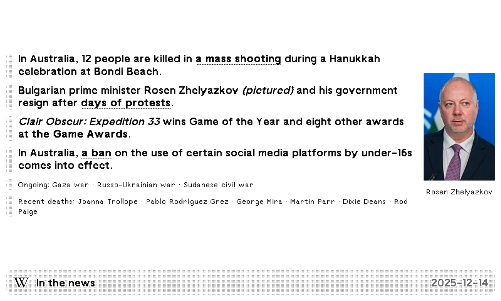 | 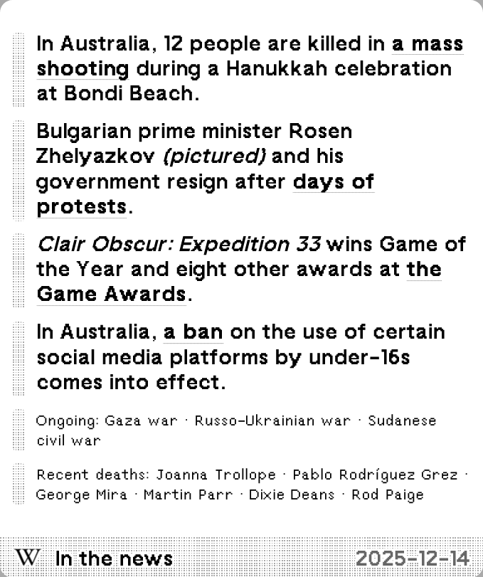 |
| Horizontal | Quad |
|  |  |

### English (Did you know)

| Full | Vertical |
| :---: | :---: |
|  |  |
| Horizontal | Quad |
| 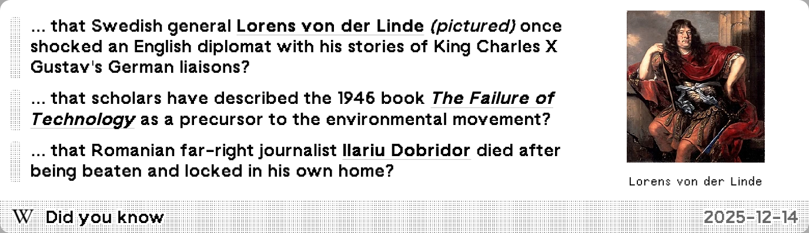 |  |

### Chinese (典范条目)

| Full | Vertical |
| :---: | :---: |
|  | 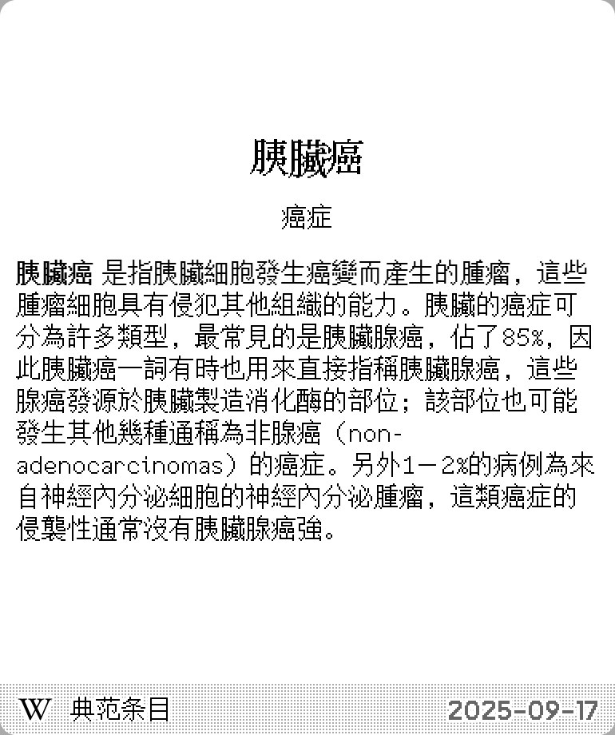 |
| Horizontal | Quad |
|  |  |

### Chinese (新闻动态)

| Full | Vertical |
| :---: | :---: |
| 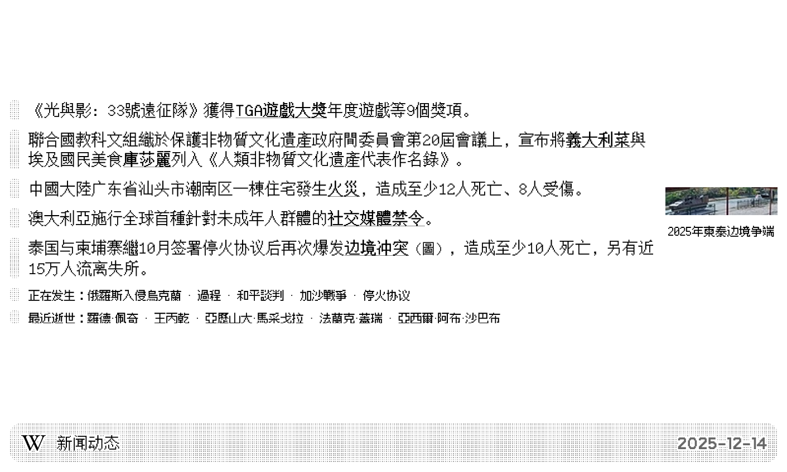 | 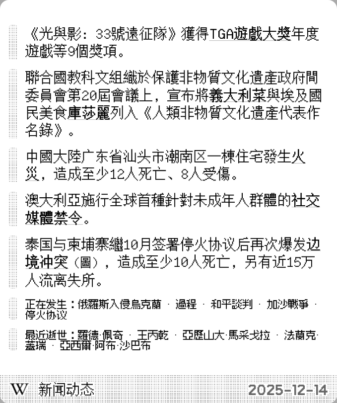 |
| Horizontal | Quad |
| 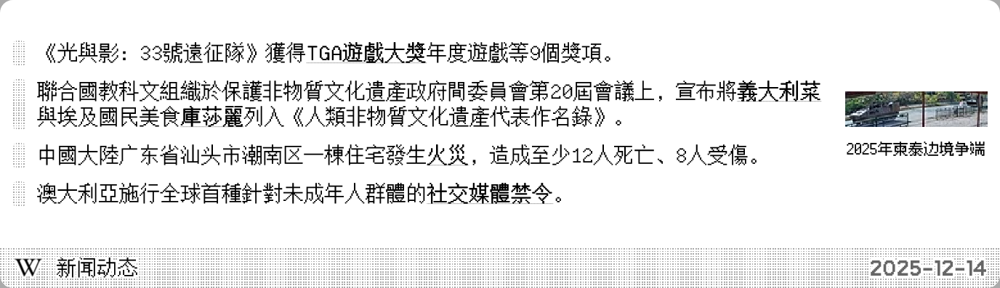 | 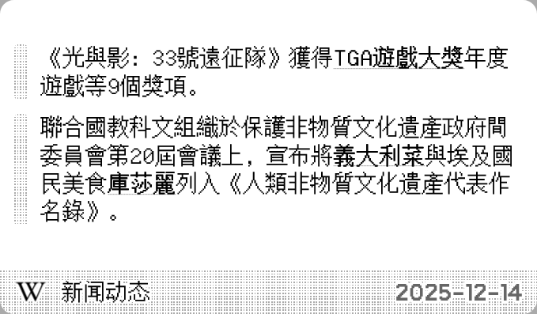 |

### Chinese (你知道吗)

| Full | Vertical |
| :---: | :---: |
| 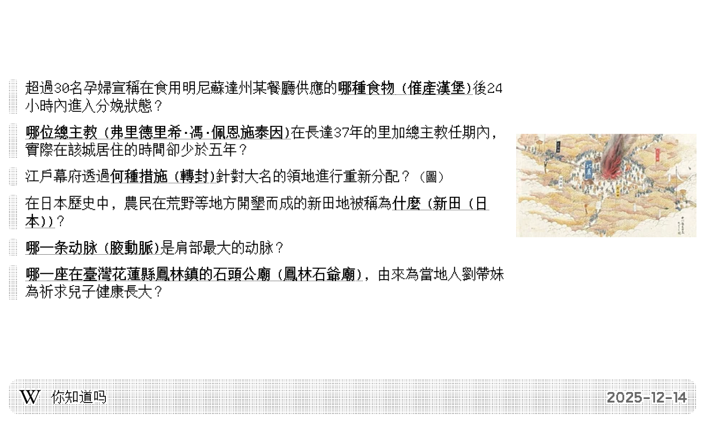 | 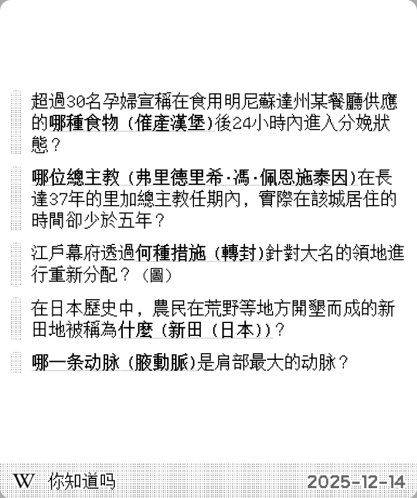 |
| Horizontal | Quad |
| 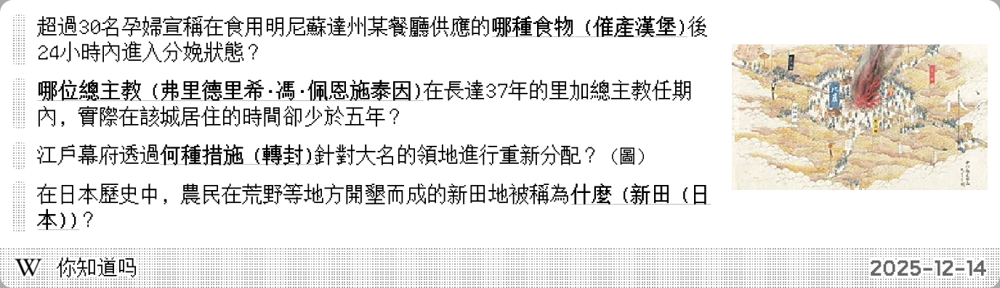 | 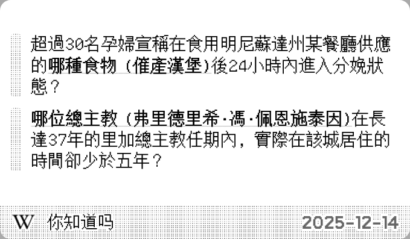 |

### Japanese

| Full | Vertical |
| :---: | :---: |
|  |  |
| Horizontal | Quad |
| 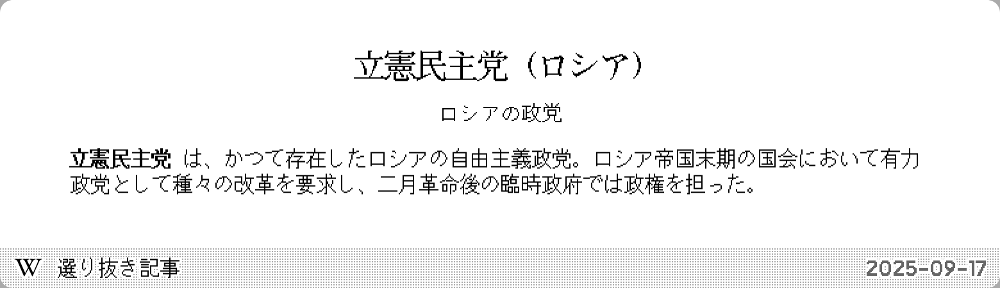 | 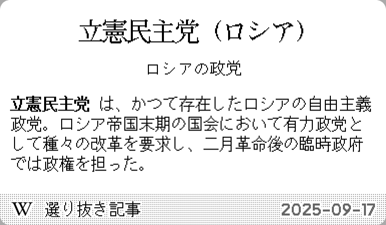 |

## Parameters

- **Language**: বাংলা (Bengali), Deutsch (German), Ελληνικά (Greek), English (English), עברית (Hebrew), Magyar (Hungarian), 日本語 (Japanese), سنڌي، سندھی ، सिन्ध (Sindhi), Svenska (Swedish), اردو (Urdu), Tiếng Việt (Vietnamese), 中文 (Chinese)
- **Date format**: Format the date, see [strftime](https://strftime.net/) for syntax. Default: `%Y-%m-%d`
- **View**: Available views: _Article of the Day_, _In the news_, _Did you know_.
