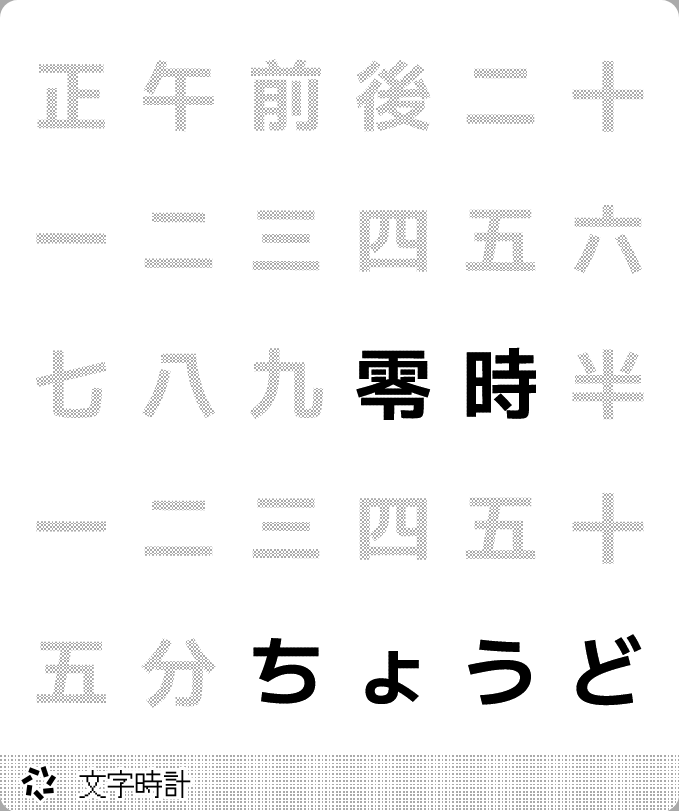
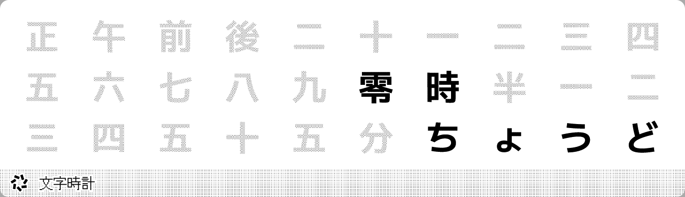
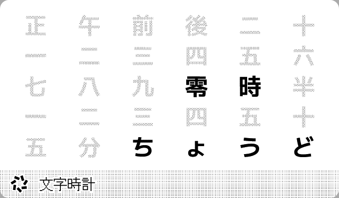

# Word Clock 日本語

Word clock in Japanese. Supports 24-hour and 12-hour formats, with a maximum display precision of 5 minutes (depending on recipe and device update frequency).

[Install](https://trmnl.com/recipes/187661)

## Screenshot

| Full | Vertical |
| :---: | :---: |
|  |  |
| Horizontal | Quad |
|  |  |

## Parameters

- Time format  
  24-hour, 12-hour, default: 24-hour
