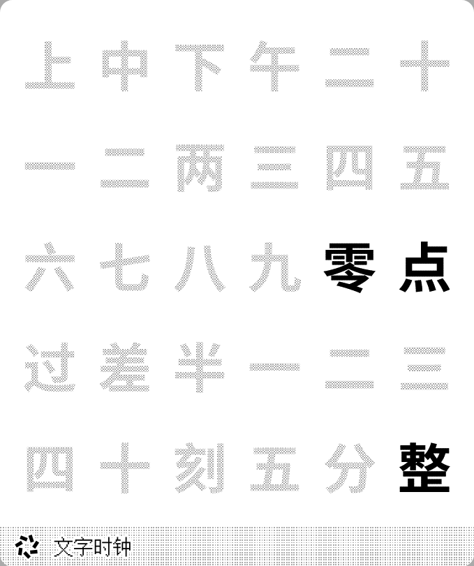
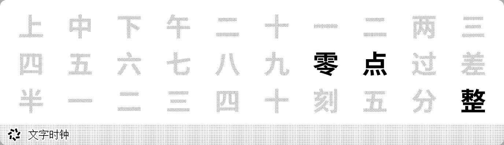
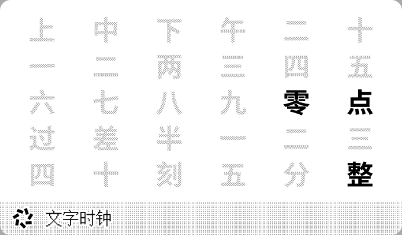

# Word Clock 中文

Word Clock in Chinese. Supports 24-hour and 12-hour formats, as well as Simplified and Traditional Chinese. The highest precision is 5 minutes (determined by the plugin and device refresh rate).

[Install](https://trmnl.com/recipes/187631)

## Screenshot

| Full | Vertical |
| :---: | :---: |
|  |  |
| Horizontal | Quad |
|  |  |

## Parameters

- Time Format  
  24-hour, 12-hour, default: 24-hour
- Script  
  Simplified, Traditional, default: Simplified
