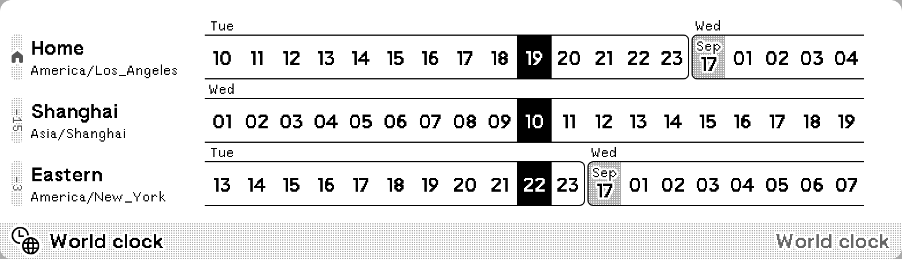
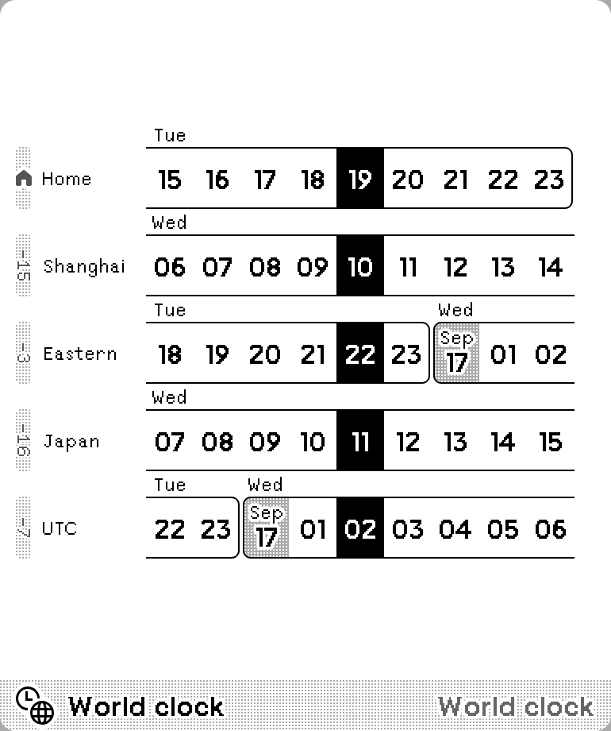

# World clock

A digital world clock shows up to 7 time zones. Inspired by [World Time Buddy](https://www.worldtimebuddy.com/) and _Windows 11 World Clock_.

[Install](https://usetrmnl.com/recipes/153664)

## Screenshots

| Full | Horizontal |
| :---: | :---: |
|  |  |
| Vertical | Quad |
|  |  |

| 12-hour | 24-hour |
| :---: | :---: |
|  |  |

## Parameters

- Time format:
  - 12-hour (midnight starting at 12:00 AM)
  - 24-hour (midnight starting at 0:00)
  - 12-hour (midnight starting at 0:00 AM)
  - 24-hour (midnight starting at 24:00)
- Home Time Zone (default to user time zone)
- Home name, default to “Home”
- Additional time zones (up to six), and names
