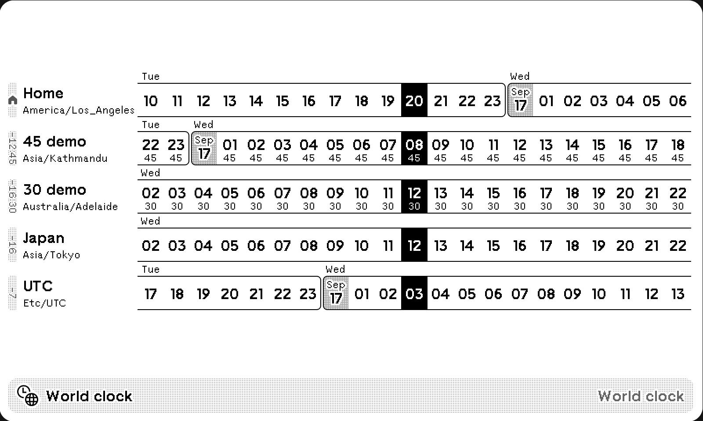

# World clock

A digital world clock shows up to 7 time zones. Inspired by [World Time Buddy](https://www.worldtimebuddy.com/) and _Windows 11 World Clock_.

<a href="https://trmnl.com/recipes/153664" target="_blank">
  <picture>
    <source media="(prefers-color-scheme: dark)" srcset="../.assets/trmnl-badge-show-it-on-dark.svg">
    <source media="(prefers-color-scheme: light)" srcset="../.assets/trmnl-badge-show-it-on-light.svg">
    
  </picture>
</a>

## Screenshots

| Full | Vertical |
| :---: | :---: |
|  |  |
| Horizontal | Quad |
|  |  |

|  24-hour | 
| :---: |
|  |
| 12-hour (12:00 AM) |
|  |
| 12-hour (0:00 AM) |
|  |

## Parameters

- Time format:
  - 12-hour (midnight starting at 12:00 AM)
  - 12-hour (midnight starting at 0:00 AM)
  - 24-hour
- Home Time Zone (default to user time zone)
- Home name, default to “Home”
- Additional time zones (up to six), and names
