# Washington DOT Real-time Travel Info

Real-time travel info from Washington State Department of Transportation (WSDOT). Show travel times, traffic cameras, and alerts on your dashboard. Data powered by [WSDOT Traffic API](https://wsdot.com/traffic/api/).

[Install](https://trmnl.com/recipes/227171)

## Screenshot

### Alerts

| Full | Vertical |
| :---: | :---: |
|  | 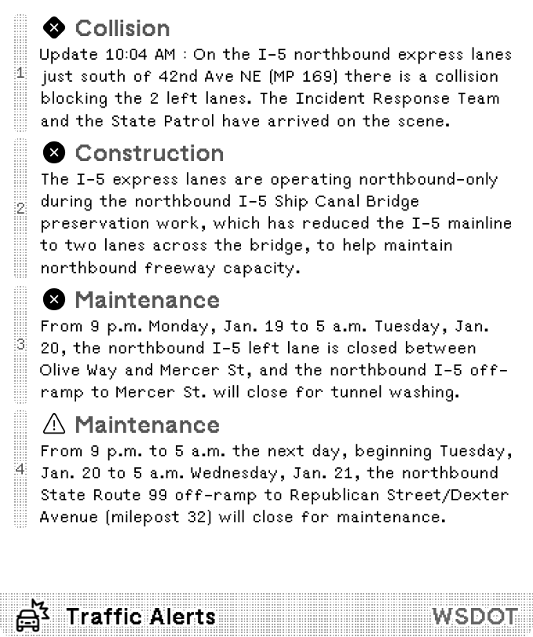 |
| Horizontal | Quad |
| 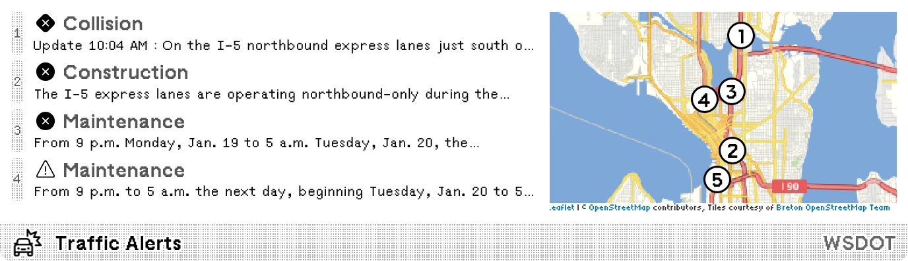 | 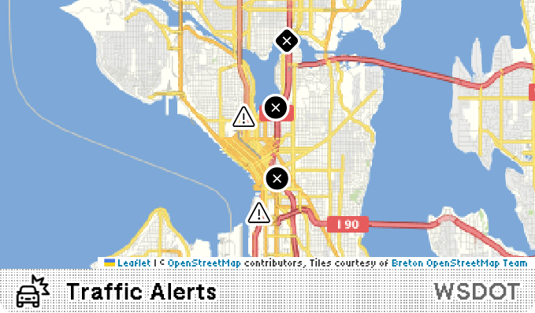 |

### Travel Time

| Full | Vertical |
| :---: | :---: |
| 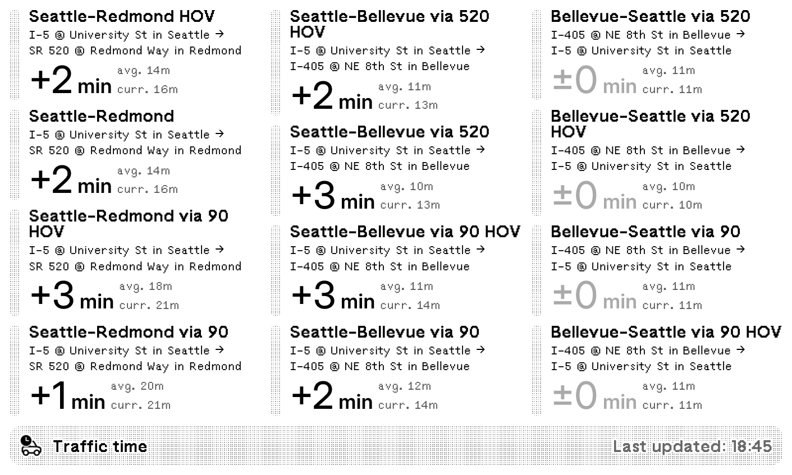 | 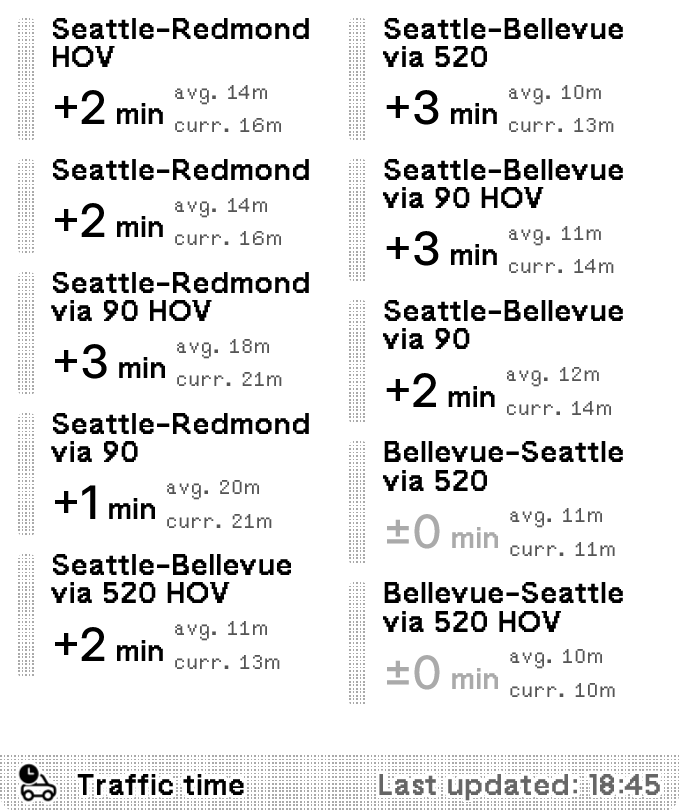 |
| Horizontal | Quad |
| 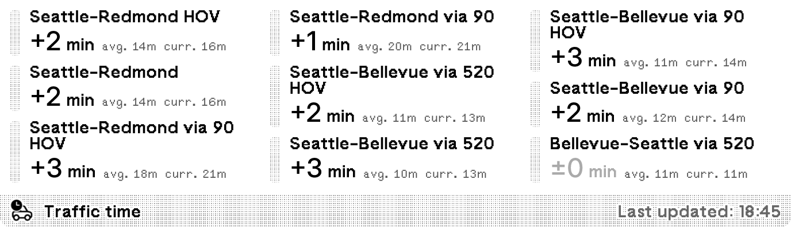 | 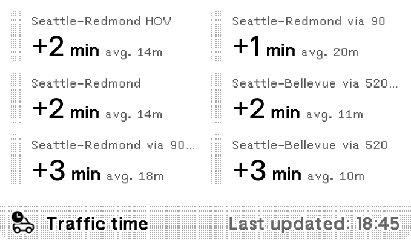 |

### Traffic Cameras

| Full | Vertical |
| :---: | :---: |
| 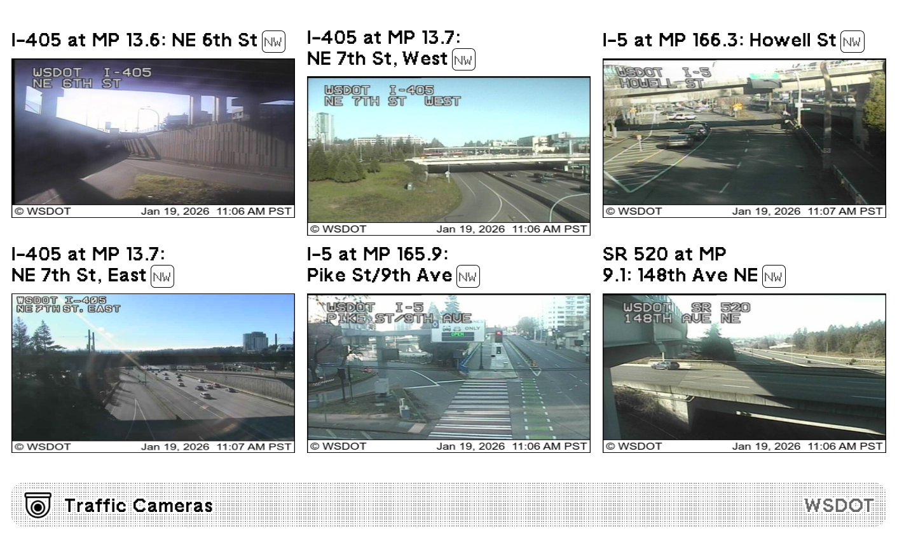 | 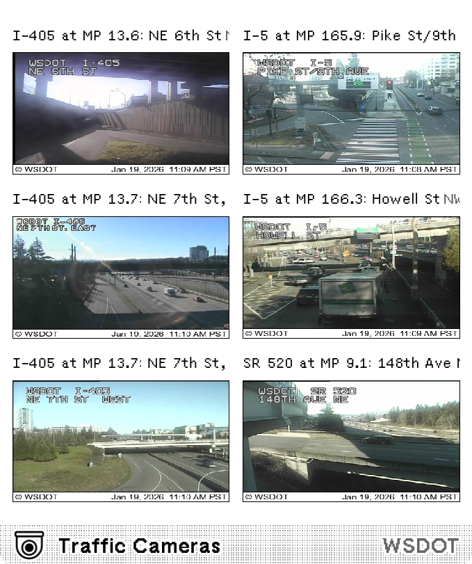 |
| Horizontal | Quad |
| 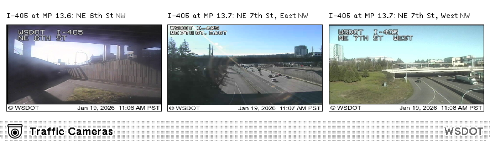 | 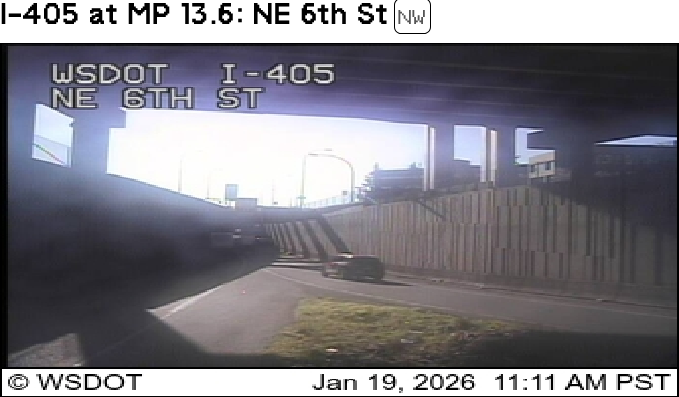 |

## Parameters

- Content to show  
  Travel time / Traffic cameras / Alerts, default: Travel time
- Name of travel time monitors  
  Names are matched partially. Find travel time monitors at [WSDOT Real-Time Travel Map](https://wsdot.com/Travel/Real-time/Map/?layers=travel-time).
- Name of traffic cameras  
  Names are matched partially. Find traffic cameras at [WSDOT Real-Time Travel Map](https://wsdot.com/Travel/Real-time/Map/?layers=camera).
- Area to show alerts for  
  Coordinate bounding box to filter alerts. Format: "left,bottom,right,top". Find coordinates at [bbox tool](https://norbertrenner.de/osm/bbox.html?zoom=8&lat=47.48661&lon=-120.73199&layers=FBT).
